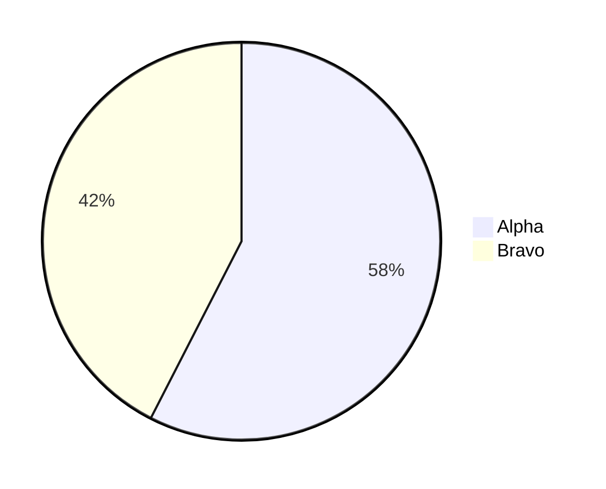

# slidev-theme-field-manual

A Slidev theme modeled on the visual language of **vintage US Army field manuals** (FM series, circa 1950s–1980s). The aesthetic is authentic and considered — evoking the clarity, authority, and utilitarian elegance of technical military print design, adapted for modern presentation use.

---

## Installation

Add the theme to your Slidev presentation:

```bash
npm install slidev-theme-field-manual
```

Then add it to your front matter:

```yaml
---
theme: slidev-theme-field-manual
---
```

---

## Features

- Muted olive / khaki / aged-paper color palette
- Display serif headings (Playfair Display) + condensed sans labels (Oswald) + monospace body (Courier Prime)
- Paper grain overlay via inline SVG (no external images)
- CSS-drawn corner brackets, crosshair reticles, and thick rule dividers
- 24 purposefully designed layouts
- Full dark mode (`colorSchema: dark`) — dark olive / night-map palette
- Custom Shiki syntax highlighting theme in both light and dark modes
- `CodeBlock` component with title bar, gutter, and caption — a first-class visual element

---

## Front Matter Example

```yaml
---
theme: slidev-theme-field-manual
title: 'FM 00-0: Your Briefing Title'
author: 'HQ, Your Organization'
colorSchema: light        # light (default) | dark
highlighter: shiki
lineNumbers: true

# Theme-specific (passed as props to layouts)
docNumber: FM 00-0
unit: 1st PRES BDE, 3rd SLIDE DIV
classification: FOR TRAINING USE ONLY
---
```

---

## Layouts

All layouts accept these common props via front matter:

| Prop | Type | Description |
|------|------|-------------|
| `title` | `string` | Slide title (also shown in header) |
| `sectionNumber` | `string` | Section ID shown in footer (e.g. `2-4`) |
| `docNumber` | `string` | Document number (e.g. `FM 21-SLIDE`) |
| `unit` | `string` | Unit label shown in footer |

### Content Layouts

#### `default`
Standard text layout. Thick top rule, title treatment, header, footer.

```md
---
layout: default
title: 1-1. SECTION TITLE
sectionNumber: 1-1
---

Content goes here.
```

#### `cover`
Light paper title slide. Dark olive frame with corner brackets and crosshair reticles; dark classification banners top and bottom; ink-black title; signal red doc number.

```md
---
layout: cover
docNumber: FM 21-SLIDE
date: FEBRUARY 2026
classification: FOR TRAINING USE ONLY
---

# TITLE HERE

<template v-slot:subtitle>
Subtitle or organization line
</template>
```

#### `section`
Chapter/section divider. Enormous ghosted number behind title.

```md
---
layout: section
sectionNumber: '3'
---

# Chapter 3
## Chapter Title

<template v-slot:descriptor>
Brief description of this chapter's scope.
</template>
```

#### `statement`
Single large pull quote or key idea. Centered, decorative red rules above and below.

```md
---
layout: statement
---

"Your key statement or pull quote here."
```

#### `end`
Final slide. END OF BRIEFING treatment with unit patch placeholder and contact block.

```md
---
layout: end
docNumber: FM 21-SLIDE
classification: FOR TRAINING USE ONLY
---

<template v-slot:title>Questions?</template>

<template v-slot:contact>
Name, Rank, Unit
contact@example.com
</template>
```

---

### Image Layouts

#### `image-right`
Text 55% left, bracketed image frame 45% right with caption.

Props: `figNumber`, `figLabel`

```md
---
layout: image-right
figNumber: 1-1
figLabel: DIAGRAM LABEL
---

Text content here.

<template v-slot:image>

</template>
```

#### `image-left`
Mirror of `image-right`.

#### `image-full`
Full-bleed background image with gradient overlay and text block anchored bottom-left.

```md
---
layout: image-full
---

<template v-slot:image>

</template>

# Title overlaid on image

<template v-slot:subtitle>
Subtitle line
</template>
```

#### `image-top`
Image spans full width top ~40%, content below. FIG. caption treatment.

Props: `figNumber`, `figLabel`

#### `image-bottom`
Content top, image bottom with FIG. caption.

Props: `figNumber`, `figLabel`

#### `two-images`
Side-by-side images, each with figure captions. Small text block above.

Props: `fig1Number`, `fig1Label`, `fig2Number`, `fig2Label`

```md
---
layout: two-images
fig1Number: 1-5
fig1Label: BEFORE
fig2Number: 1-6
fig2Label: AFTER
---

Introductory text.

<template v-slot:image1>

</template>

<template v-slot:image2>

</template>
```

---

### Data / Chart Layouts

#### `chart-right`
Text/bullets left, chart area right with grid background.

Props: `figNumber`, `figLabel`

```md
---
layout: chart-right
figNumber: 2-1
figLabel: CHART TITLE
---

Analysis text.

<template v-slot:chart>
<!-- Mermaid, table, or other content -->
</template>
```

#### `chart-left`
Mirror of `chart-right`.

#### `chart-full`
Chart/diagram takes 70% of slide height. Title above, caption + source below.

Props: `figNumber`, `figLabel`

```md
---
layout: chart-full
title: CHART SLIDE TITLE
figNumber: 3-1
figLabel: DESCRIPTION
---

<template v-slot:chart>

</template>

<template v-slot:source>
SOURCE: FM 21-SLIDE, TABLE B-1
</template>
```

#### `dashboard`
2×2 grid of panels, each with a label, content area, and caption.

Props: `panel1Label`, `panel2Label`, `panel3Label`, `panel4Label`

Named slots: `panel1`–`panel4`, `caption1`–`caption4`

#### `comparison`
Two columns with a dividing VS rule. Each column has its own header.

Props: `leftHeader`, `rightHeader`, `leftAccent` (`red`|`blue`|`olive`), `rightAccent`

Named slots: `left`, `right`

---

### Code Layouts

#### `code-right`
Prose left 50%, code panel right 50% in a ruled frame with corner brackets.

Props: `codeTitle`, `codeLang`

Named slots: `code`, `caption`

```md
---
layout: code-right
title: SLIDE TITLE
codeTitle: LISTING 2-1 — PROCEDURE
codeLang: python
---

Explanation text on the left.

<template v-slot:code>
```python
def example():
    pass
```
</template>

<template v-slot:caption>
Caption line below code panel
</template>
```

#### `code-full`
Code block takes full content area with prominent title bar and caption.

Props: `codeTitle`, `codeLang`

Named slot: `caption`

```md
---
layout: code-full
codeTitle: LISTING 3-1 — INSTALLATION PROCEDURE
codeLang: bash
---

```bash
npm install slidev-theme-field-manual
```

<template v-slot:caption>
VERIFIED ON LINUX / MACOS / WINDOWS WSL2
</template>
```

---

### Specialty Layouts

#### `timeline`
CSS-only timeline. Prop `direction`: `'horizontal'` (default) | `'vertical'`.

Use `.tl-entry` divs with `.tl-entry-marker`, `.tl-entry-dot`, `.tl-entry-body`, `.tl-entry-date`, `.tl-entry-title`, `.tl-entry-desc` elements inside the default slot.

#### `table-of-contents`
Field manual ToC with dot leaders and section numbers. Use `.toc-entry` divs with `.toc-entry-num`, `.toc-entry-title`, `.toc-leaders`, `.toc-entry-page` spans. Add `.toc-entry--chapter` for chapter-level entries.

#### `quote`
Attributed quotation. Props: `attribution`, `rank`, `unit`.

#### `two-column`
Equal two columns with a center dividing rule. Named slots: `left`, `right`.

#### `three-column`
Three equal panels each with a header. Props: `col1Header`, `col2Header`, `col3Header`. Named slots: `header1`–`header3`, `col1`–`col3`.

#### `callout`
Main content with a prominent callout box. Props: `calloutType` (`warning`|`note`|`caution`|`important`), `calloutTitle`. Named slot: `callout`.

---

## Components

### `FieldManualHeader`

Renders the document header bar (thick bottom rule, doc number left, title center, classification right).

| Prop | Type | Default |
|------|------|---------|
| `title` | `string` | `''` |
| `sectionNumber` | `string` | `''` |
| `docNumber` | `string` | `'FM 21-SLIDE'` |
| `classification` | `string` | `'UNCLASSIFIED'` |

### `FieldManualFooter`

Renders the footer bar (thick top rule, section-page number left, unit/doc center, slide count right).

| Prop | Type | Default |
|------|------|---------|
| `sectionNumber` | `string` | `'1-1'` |
| `unit` | `string` | `''` |
| `docLabel` | `string` | `'FM 21-SLIDE'` |

Uses `useNav()` to auto-inject current page / total page count.

### `Callout`

Field manual WARNING/NOTE/CAUTION/IMPORTANT box with dashed border.

| Prop | Type | Default | Values |
|------|------|---------|--------|
| `type` | `string` | `'note'` | `'warning'` \| `'note'` \| `'caution'` \| `'important'` |
| `title` | `string` | _(type label)_ | Any string |

```md
<Callout type="warning" title="WARNING — LASER POINTER">
Do not aim at personnel. Eye injury hazard.
</Callout>
```

### `FigureCaption`

Renders `FIG. {number} — {LABEL}` in small caps monospace below a figure.

| Prop | Type | Description |
|------|------|-------------|
| `number` | `string \| number` | Figure number |
| `label` | `string` | Figure label (displayed uppercase) |

```md
<FigureCaption number="1-3" label="TERRAIN MODEL — SECTOR NORTH" />
```

### `ClassificationBanner`

Full-width classification banner. Clearly decorative/thematic.

| Prop | Type | Default | Description |
|------|------|---------|-------------|
| `text` | `string` | `'FOR TRAINING USE ONLY'` | Banner text |
| `variant` | `string` | `'default'` | `'default'` \| `'alert'` (red background) |

### `CodeBlock`

Full field manual styled code block — first-class design system element.

| Prop | Type | Default | Description |
|------|------|---------|-------------|
| `lang` | `string` | — | Language identifier shown in badge (e.g. `bash`, `python`, `yaml`) |
| `title` | `string` | — | Title bar text. If absent, header bar is hidden. |
| `lineNumbers` | `boolean` | `true` | Show line numbers in gutter |
| `rulers` | `boolean` | `false` | Faint horizontal rule every 5 lines |
| `caption` | `string` | — | Footer caption. Also available as named slot `caption`. |

```md
<CodeBlock
  lang="bash"
  title="LISTING 2-1 — INSTALLATION PROCEDURE"
  :lineNumbers="true"
  :rulers="false"
  caption="SOURCE: FM 21-SLIDE, PARA 3-1"
>

```bash
npm install slidev-theme-field-manual
```

</CodeBlock>
```

The `CodeBlock` component works standalone on any layout and is also used internally by `code-right` and `code-full` layouts.

---

## CSS Custom Properties Reference

Override these in your presentation's `style.css` or via `:root` in a custom CSS file:

### Color Palette

| Variable | Light Value | Description |
|----------|-------------|-------------|
| `--c-olive` | `#4a4a2a` | Primary olive |
| `--c-olive-mid` | `#5c5c30` | Mid olive |
| `--c-olive-light` | `#7a7a45` | Light olive |
| `--c-khaki` | `#b5a060` | Primary khaki |
| `--c-khaki-light` | `#c8b87a` | Light khaki |
| `--c-paper` | `#f5f0e0` | Primary background |
| `--c-paper-dark` | `#ede8d0` | Secondary background |
| `--c-ink` | `#1a1a14` | Primary text |
| `--c-red` | `#8b1a1a` | Signal red accent |
| `--c-blue` | `#2a3d5c` | Blueprint blue accent |

### Semantic Aliases

| Variable | Description |
|----------|-------------|
| `--color-bg` | Slide background |
| `--color-bg-alt` | Header/footer background |
| `--color-fg` | Primary text |
| `--color-fg-muted` | Secondary text |
| `--color-accent` | Primary accent (red) |
| `--color-accent-alt` | Secondary accent (blue) |
| `--color-rule` | Rule/border color |
| `--color-header-bg` | Header bar background |
| `--color-header-fg` | Header bar text |

### Typography

| Variable | Value | Description |
|----------|-------|-------------|
| `--font-heading` | Playfair Display | Display serif — slide titles, cover, section titles |
| `--font-body` | Source Serif 4 | Body font stack |
| `--font-mono` | Courier Prime | Monospace font stack |
| `--font-label` | Courier Prime | Monospace label/caption font |
| `--font-condensed-sans` | Oswald | Condensed sans-serif — headers, footers, labels, captions, callouts |

### Type Scale

| Variable | Range | Usage |
|----------|-------|-------|
| `--text-xs` | 0.60–0.70rem | Labels, captions |
| `--text-sm` | 0.70–0.85rem | Small body, code |
| `--text-base` | 0.85–1.05rem | Body text |
| `--text-md` | 1.00–1.20rem | Medium |
| `--text-lg` | 1.20–1.60rem | Sub-headings |
| `--text-xl` | 1.60–2.20rem | Slide titles |
| `--text-2xl` | 2.00–3.00rem | Large headings |
| `--text-3xl` | 2.80–4.20rem | Cover elements |

### Rules & Spacing

| Variable | Value | Description |
|----------|-------|-------------|
| `--rule-thick` | `3px` | Primary rule weight |
| `--rule-mid` | `2px` | Secondary rule weight |
| `--rule-thin` | `1px` | Thin rule |
| `--bracket-size` | `14px` | Corner bracket size |
| `--tracking-wide` | `0.12em` | Label letter spacing |
| `--tracking-wider` | `0.20em` | Header letter spacing |
| `--tracking-widest` | `0.32em` | Classification letter spacing |

---

## Color Schema Support

The theme fully supports both `colorSchema: light` and `colorSchema: dark`.

**Light** (default): Aged paper — warm off-white background, olive rules, ink text.

**Dark**: Night map — dark olive background, khaki text, brighter syntax colors for legibility.

Set in front matter:
```yaml
colorSchema: dark
```

Or toggle with the keyboard shortcut `D` in Slidev's presenter mode.

---

## Screenshots

_(Screenshots pending — see `example.md` for a full 30-slide showcase of every layout.)_

---

## License

© pjdoland. All rights reserved.
