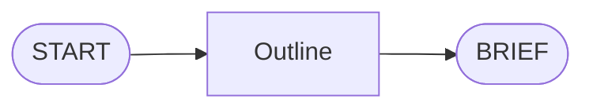

# slidev-theme-field-manual

A Slidev theme modeled on the visual language of **vintage US Army field manuals** (FM series, circa 1950s–1980s). The aesthetic is authentic and considered — evoking the clarity, authority, and utilitarian elegance of technical military print design, adapted for modern presentation use.

---

## Installation

```bash
npm install slidev-theme-field-manual
```

Then reference it in your front matter:

```yaml
---
theme: slidev-theme-field-manual
---
```

---

## Front Matter

```yaml
---
theme: slidev-theme-field-manual
title: 'FM 00-0: Your Briefing Title'
author: 'HQ, Your Organization'
colorSchema: light        # light (default) | dark
highlighter: shiki
lineNumbers: true

# Theme-specific props passed to every layout
docNumber: FM 00-0
date: FEBRUARY 2026
unit: 1st PRES BDE, 3rd SLIDE DIV
classification: FOR TRAINING USE ONLY
---
```

---

## Features

- Aged-paper / night-map palette with full `colorSchema: light` and `colorSchema: dark` support
- Four-font system: Playfair Display (display serif) · Oswald (condensed sans) · Source Serif 4 (body) · Courier Prime (mono/label)
- Paper grain texture overlay with `mix-blend-mode: multiply`
- CSS-drawn corner brackets, crosshair reticles, dot leaders, and thick rule dividers — no images required
- 24 purposefully designed layouts covering every common briefing structure
- Custom Shiki syntax highlighting in both light and dark modes — earth-tone palette matches the paper background
- `CodeBlock` component: title bar, language badge, line-number gutter, optional ruler lines, caption
- `Callout` component: Warning · Caution · Note · Important — each with distinct color treatment
- Classification banners on every slide via `FieldManualHeader` and `FieldManualFooter`

---

## Layouts

All layouts accept these common props via slide front matter:

| Prop | Type | Description |
|------|------|-------------|
| `title` | `string` | Slide title shown in header |
| `sectionNumber` | `string` | Section ID shown in footer (e.g. `2-4`) |
| `docNumber` | `string` | Document number (e.g. `FM 00-0`) |
| `unit` | `string` | Unit label shown in footer |
| `classification` | `string` | Classification banner text |

### Structural

#### `cover`
Title slide. Light paper background, dark olive frame with corner brackets and crosshair reticles, classification banners top and bottom. The h1 is the document designation; h2 is the subtitle.

Props: `docNumber`, `date`, `classification`
Slots: `title` (or default), `subtitle`, `meta`

```md
---
layout: cover
docNumber: FM 00-0
date: FEBRUARY 2026
classification: FOR TRAINING USE ONLY
---

# FM 00-0
## A Field Manual for the Modern Presenter

<template v-slot:subtitle>
CPT J. Smith · Department of the Presentation
</template>
```

#### `section`
Chapter divider. Enormous ghosted section number behind the title; red accent rule; descriptor block. Uses the same light paper background as `cover`.

Props: `sectionNumber`, `docNumber`
Slots: `descriptor`

```md
---
layout: section
sectionNumber: '2'
docNumber: FM 00-0
---

# Chapter 2
## Tactical Use of Slides

<template v-slot:descriptor>
Brief description of this chapter's scope.
</template>
```

#### `default`
Primary workhorse layout. Full-width content area with header, footer, and standard heading treatment.

#### `statement`
Single large pull quote or key principle. Centered in large Oswald display type; red rules above and below. No header or footer.

```md
---
layout: statement
---

"One slide, one idea."
```

#### `end`
Final slide. Formal END OF BRIEFING treatment with presenter photo (cropped to circle), contact block, and classification banners on both edges.

Props: `docNumber`, `classification`, `photo` (URL or local path)
Slots: `title`, `contact`

```md
---
layout: end
docNumber: FM 00-0
classification: FOR TRAINING USE ONLY
photo: ./assets/presenter.jpg
---

<template v-slot:title>Questions?</template>

<template v-slot:contact>
CPT J. Smith · Department of the Presentation
john.smith@example.mil
</template>
```

#### `table-of-contents`
Regulation-style ToC with dot leaders, section-number column, and a chapter-entry modifier class. Use `.toc-entry` divs with `.toc-entry-num`, `.toc-entry-title`, `.toc-leaders`, `.toc-entry-page` spans. Add `.toc-entry--chapter` for chapter-level rows (olive background, bold Oswald).

Props: `title`, `docNumber`, `sectionNumber`

---

### Image

All image layouts accept `figNumber` and `figLabel` props which render a standardized `FIG. X — LABEL` caption via `FigureCaption`.

#### `image-right`
Text column left (~55%), bracketed image panel right (~45%).

Slots: `image`

```md
---
layout: image-right
figNumber: 1-1
figLabel: BRIEFING ROOM — STANDARD CONFIGURATION
---

Text content here.

<template v-slot:image>

</template>
```

#### `image-left`
Mirror of `image-right`.

#### `image-full`
Full-bleed background image with a translucent gradient overlay for legibility. No header or footer chrome — use as a visual interlude or dramatic transition.

Slots: `image`, `title` (or default), `subtitle`

```md
---
layout: image-full
---

<template v-slot:image>

</template>

# Title overlaid on image

<template v-slot:subtitle>Subtitle line</template>
```

#### `image-top`
Image spans full width in the upper ~40% of the slide; content area below.

Slots: `image`

#### `image-bottom`
Content above, image below.

Slots: `image`

#### `two-images`
Side-by-side images, each with an independent figure caption. Small text block above both.

Props: `fig1Number`, `fig1Label`, `fig2Number`, `fig2Label`
Slots: `image1`, `image2`

```md
---
layout: two-images
fig1Number: 1-5
fig1Label: BEFORE — UNFORMATTED
fig2Number: 1-6
fig2Label: AFTER — FIELD MANUAL TREATMENT
---

Introductory text above both images.

<template v-slot:image1></template>
<template v-slot:image2></template>
```

---

### Code

#### `code-right`
Prose/bullets left 50%, field-manual-styled code panel right 50% with title bar, language badge, corner brackets.

Props: `codeTitle`, `codeLang`
Slots: `code`, `caption`

````md
---
layout: code-right
title: 3-2. SLIDE FRONT MATTER
codeTitle: LISTING 3-2 — FRONT MATTER CONFIG
codeLang: yaml
---

Explanation text on the left.

<template v-slot:code>
```yaml
theme: slidev-theme-field-manual
colorSchema: light
```
</template>

<template v-slot:caption>
REPLACE PLACEHOLDERS WITH OPERATIONAL VALUES
</template>
````

#### `code-full`
Code panel fills the entire content area with a prominent title bar and optional caption below.

Props: `codeTitle`, `codeLang`
Slots: `caption` (code goes in the default slide body as a fenced block)

````md
---
layout: code-full
codeTitle: LISTING 3-1 — INSTALLATION PROCEDURE
codeLang: bash
---

```bash
npm install slidev-theme-field-manual
```

<template v-slot:caption>
VERIFIED ON LINUX / MACOS / WINDOWS WSL2
</template>
````

---

### Chart

All chart layouts use Slidev's native Mermaid renderer. Props: `figNumber`, `figLabel`.

Set a global palette in front matter so diagrams match the paper background:

```yaml
mermaid:
  theme: base
  fontFamily: "'Courier Prime', monospace"
  themeVariables:
    background: '#f5f0e0'
    primaryColor: '#ede8d0'
    primaryTextColor: '#1a1a14'
    primaryBorderColor: '#8a7a50'
    lineColor: '#4a4a2a'
```

#### `chart-full`
Diagram fills the content area. Optional source credit slot below.

Slots: `chart`, `source`

````md
---
layout: chart-full
figNumber: 3-1
figLabel: BRIEFING WORKFLOW
---

<template v-slot:chart>

</template>
````

#### `chart-right`
Text/bullets left, chart panel right. Slots: `chart`

#### `chart-left`
Chart panel left, text right. Slots: `chart`

---

### Multi-column

#### `two-column`
Equal halves with a center dividing rule. Any `h2` inside a column gets the Oswald caps + border treatment automatically.

Slots: `left`, `right`

#### `three-column`
Three equal panels each with a labeled header.

Props: `col1Header`, `col2Header`, `col3Header`
Slots: `col1`, `col2`, `col3`

#### `comparison`
Two columns with distinct accent colors for structured option analysis.

Props: `leftHeader`, `rightHeader`, `leftAccent` (`red`|`blue`|`olive`), `rightAccent`
Slots: `left`, `right`

#### `callout`
Full content area with a prominent Warning/Caution/Note/Important box anchored below.

Props: `calloutType` (`warning`|`caution`|`note`|`important`), `calloutTitle`
Slots: `callout`

---

### Specialty

#### `quote`
Attributed quotation in large display type with a citation line.

Props: `attribution`, `rank`, `unit`, `sectionNumber`

```md
---
layout: quote
attribution: GEN Omar N. Bradley
rank: General of the Army
unit: 12th Army Group
---

"The art of war is the art of the possible."
```

#### `timeline`
CSS-only horizontal or vertical event sequence.

Props: `direction` (`horizontal` | `vertical`)

Each event is a `.tl-entry` div containing `.tl-entry-marker > .tl-entry-dot` and `.tl-entry-body` with `.tl-entry-date`, `.tl-entry-title`, `.tl-entry-desc` children.

#### `dashboard`
2×2 status panel grid, each cell with a label, content area, and caption.

Props: `panel1Label`–`panel4Label`
Slots: `panel1`–`panel4`, `caption1`–`caption4`

---

## Components

### `Callout`

Inline Warning / Caution / Note / Important box. Can be used on any layout.

| Prop | Type | Default | Values |
|------|------|---------|--------|
| `type` | `string` | `'note'` | `warning` · `caution` · `note` · `important` |
| `title` | `string` | _(type label)_ | Any string |

Colors: warning → signal red · caution → amber · note → olive · important → navy blue

```md
<Callout type="warning" title="WARNING — LASER POINTER">
Do not aim at personnel. Eye injury hazard.
</Callout>
```

### `CodeBlock`

Standalone code panel — the same visual treatment used by `code-right` and `code-full` layouts. Drop it inline on any layout.

| Prop | Type | Default | Description |
|------|------|---------|-------------|
| `lang` | `string` | — | Language badge (e.g. `bash`, `python`, `yaml`) |
| `title` | `string` | — | Title bar text; omit to hide the header bar |
| `lineNumbers` | `boolean` | `true` | Line-number gutter |
| `rulers` | `boolean` | `false` | Faint horizontal rule every 5 lines |
| `caption` | `string` | — | Footer caption text |

````md
<CodeBlock lang="bash" title="LISTING 2-1 — PROCEDURE" :rulers="false">

```bash
npm run dev
```

</CodeBlock>
````

### `FigureCaption`

Renders `FIG. {number} — {LABEL}` in small-caps monospace. Used automatically by image and chart layouts; also available standalone.

```md
<FigureCaption number="1-3" label="TERRAIN MODEL — SECTOR NORTH" />
```

### `FieldManualHeader`

Document header bar: doc number left · title center · classification right. Included automatically by all layouts except `cover`, `statement`, `image-full`, and `end`.

| Prop | Default |
|------|---------|
| `title` | `''` |
| `sectionNumber` | `''` |
| `docNumber` | `'FM 00-0'` |
| `classification` | `'UNCLASSIFIED'` |

### `FieldManualFooter`

Footer bar: section-page number left · doc number center · slide count right. Uses `$nav?.currentPage` (Slidev's injected global) for live slide count — no local package install required.

| Prop | Default |
|------|---------|
| `sectionNumber` | `'1-1'` |
| `unit` | `''` |
| `docLabel` | `'FM 00-0'` |

### `ClassificationBanner`

Full-width classification stripe. Used by `cover` and `end`; available standalone.

| Prop | Default | Notes |
|------|---------|-------|
| `text` | `'FOR TRAINING USE ONLY'` | |
| `variant` | `'default'` | `'alert'` for red background |

---

## CSS Custom Properties

Override in your presentation's `style.css` or via `:root {}` in a custom CSS file.

### Color Palette (light / dark)

| Variable | Light | Dark | Description |
|----------|-------|------|-------------|
| `--c-paper` | `#f5f0e0` | `#1e2214` | Primary background |
| `--c-paper-dark` | `#ede8d0` | `#161a0e` | Secondary background |
| `--c-paper-deeper` | `#e0d8be` | `#12150a` | Panel background |
| `--c-ink` | `#1a1a14` | `#e8e0c8` | Primary text |
| `--c-ink-muted` | `#3a3830` | `#c8b87a` | Secondary text |
| `--c-olive-dark` | `#2a3018` | `#3d5a22` | Deep olive |
| `--c-olive` | `#3d4a22` | `#4a6a28` | Mid-dark olive |
| `--c-olive-mid` | `#4a5c28` | `#5c7a30` | Mid olive |
| `--c-olive-light` | `#7a7a45` | `#8a9a55` | Light olive |
| `--c-khaki-dark` | `#8a7a50` | `#6a5c38` | Dark khaki |
| `--c-khaki` | `#b5a060` | `#9a8c6a` | Primary khaki |
| `--c-khaki-light` | `#c8b87a` | `#b5a060` | Light khaki |
| `--c-amber` | `#b05e10` | `#c87c30` | Caution amber |
| `--c-red` | `#bf2020` | `#c04040` | Signal red accent |
| `--c-blue` | `#2a3d5c` | `#4a6a9a` | Blueprint blue accent |

### Semantic Aliases

| Variable | Description |
|----------|-------------|
| `--color-bg` | Slide background (`--c-paper`) |
| `--color-bg-alt` | Header/footer background |
| `--color-bg-panel` | Panel/inset background |
| `--color-fg` | Primary text |
| `--color-fg-muted` | Secondary/muted text |
| `--color-accent` | Primary accent (red) |
| `--color-rule` | Rule and border color |

### Typography

| Variable | Value | Usage |
|----------|-------|-------|
| `--font-heading` | Playfair Display | Display serif — cover h1, section ghost number |
| `--font-condensed-sans` | Oswald | Headers, footers, labels, h1/h2 in content |
| `--font-body` | Source Serif 4 | Body prose |
| `--font-mono` | Courier Prime | Code, monospace body |
| `--font-label` | Courier Prime | Captions, figure labels, classification banners |

### Type Scale

| Variable | Range | Usage |
|----------|-------|-------|
| `--text-xs` | 0.60–0.70rem | Labels, captions |
| `--text-sm` | 0.70–0.85rem | Small body, code |
| `--text-base` | 0.85–1.05rem | Body text |
| `--text-md` | 1.00–1.20rem | Medium body |
| `--text-lg` | 1.20–1.60rem | Sub-headings |
| `--text-xl` | 1.60–2.20rem | Slide titles |
| `--text-2xl` | 2.00–3.00rem | Large headings |
| `--text-3xl` | 2.80–4.20rem | Cover / section display |

### Rules & Spacing

| Variable | Value | Description |
|----------|-------|-------------|
| `--rule-thick` | `3px` | Primary rule weight |
| `--rule-mid` | `2px` | Secondary rule weight |
| `--rule-thin` | `1px` | Thin rule |
| `--bracket-size` | `14px` | Corner bracket arm length |
| `--tracking-wide` | `0.12em` | Label letter spacing |
| `--tracking-wider` | `0.20em` | Header letter spacing |
| `--tracking-widest` | `0.32em` | Classification banner spacing |

---

## Dark Mode

The theme fully supports `colorSchema: dark` — a night-map palette with dark olive backgrounds and khaki text.

```yaml
colorSchema: dark
```

All 24 layouts include dark-mode overrides. Layout-specific rules that would be invisible against the dark paper background (near-black olive vars) are overridden in `styles/index.css` using high-specificity selectors, supplemented by scoped `:global(.dark)` rules in `cover.vue` and `section.vue`.

**Mermaid diagrams** require manual palette switching — set a separate `%%{init}%%` directive per diagram for dark, or swap the `themeVariables` block in your global front matter. There is no Slidev-native mechanism to branch mermaid config by color schema.

---

## Running the Example

```bash
npx slidev example.md          # dev server with hot reload at localhost:3030
npx slidev build example.md    # static build
npx slidev export example.md   # export to PDF/PNG
```

The `example.md` file is a 33-slide showcase demonstrating every layout, component, and feature in the theme.

---

## License

© pjdoland. All rights reserved.
