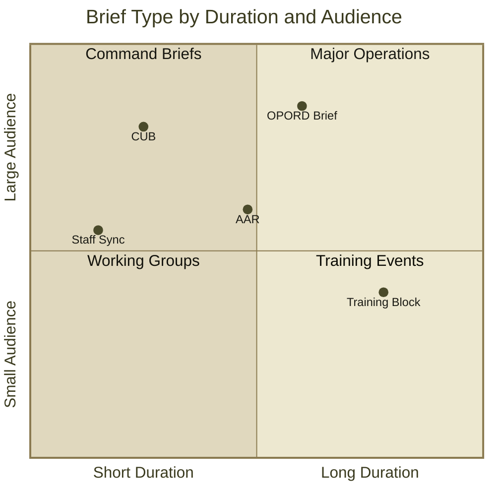
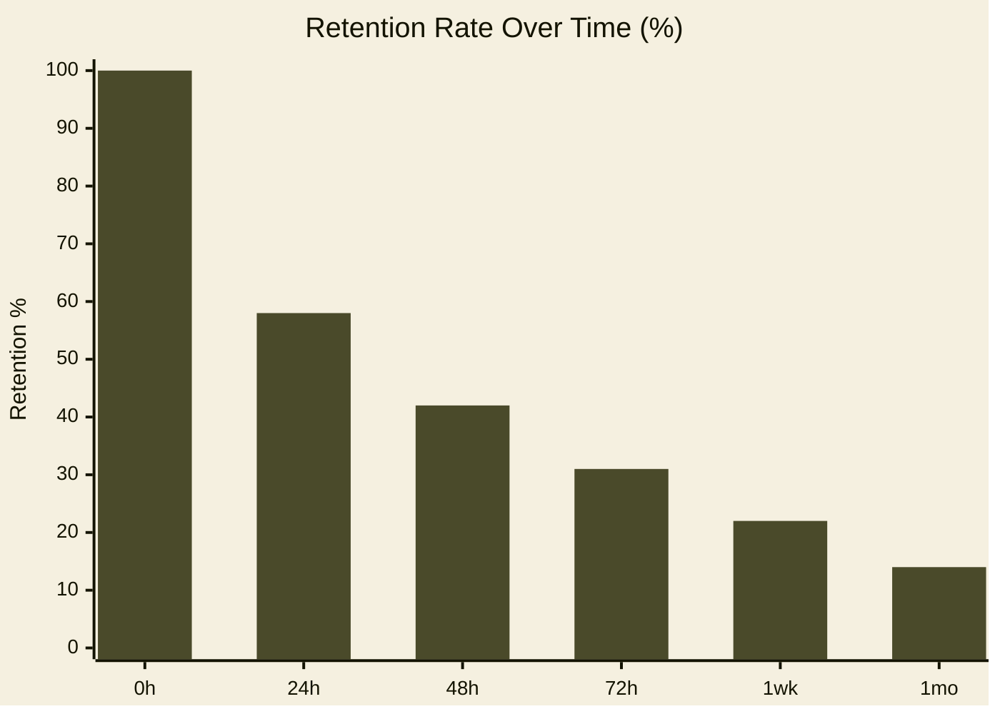

<!-- Slide 1 — Cover -->

# FM 21-SLIDE
## A Field Manual for the Modern Presenter 

<template v-slot:subtitle>

CPT John Q. Presenter · Department of the Presentation

</template>

---
layout: table-of-contents
docNumber: FM 21-SLIDE
sectionNumber: TOC
title: TABLE OF CONTENTS
---

<div class="toc-entry toc-entry--chapter">
  <span class="toc-entry-num">CH. 1</span>
  <span class="toc-entry-title">Fundamentals of the Briefing Room</span>
  <span class="toc-leaders"></span>
  <span class="toc-entry-page">3</span>
</div>
<div class="toc-entry">
  <span class="toc-entry-num">1-1</span>
  <span class="toc-entry-title">Purpose and Scope</span>
  <span class="toc-leaders"></span>
  <span class="toc-entry-page">3</span>
</div>
<div class="toc-entry">
  <span class="toc-entry-num">1-2</span>
  <span class="toc-entry-title">Equipment and Materiel</span>
  <span class="toc-leaders"></span>
  <span class="toc-entry-page">5</span>
</div>
<div class="toc-entry toc-entry--chapter">
  <span class="toc-entry-num">CH. 2</span>
  <span class="toc-entry-title">Tactical Use of Slides</span>
  <span class="toc-leaders"></span>
  <span class="toc-entry-page">8</span>
</div>
<div class="toc-entry">
  <span class="toc-entry-num">2-1</span>
  <span class="toc-entry-title">Slide Discipline and Sequence</span>
  <span class="toc-leaders"></span>
  <span class="toc-entry-page">8</span>
</div>
<div class="toc-entry">
  <span class="toc-entry-num">2-2</span>
  <span class="toc-entry-title">Callout Boxes and Warning Notices</span>
  <span class="toc-leaders"></span>
  <span class="toc-entry-page">11</span>
</div>
<div class="toc-entry toc-entry--chapter">
  <span class="toc-entry-num">CH. 3</span>
  <span class="toc-entry-title">Technical Listings and Code Displays</span>
  <span class="toc-leaders"></span>
  <span class="toc-entry-page">14</span>
</div>
<div class="toc-entry">
  <span class="toc-entry-num">3-1</span>
  <span class="toc-entry-title">Installation Procedures</span>
  <span class="toc-leaders"></span>
  <span class="toc-entry-page">14</span>
</div>
<div class="toc-entry">
  <span class="toc-entry-num">A-1</span>
  <span class="toc-entry-title">Appendix A — Reference Tables</span>
  <span class="toc-leaders"></span>
  <span class="toc-entry-page">22</span>
</div>

---
layout: section
sectionNumber: '1'
docNumber: FM 21-SLIDE
---

# Chapter 1
## Fundamentals of the Briefing Room

<template v-slot:descriptor>
An introduction to purpose, scope, and the basic materiel required for effective presentation operations.
</template>

---
layout: default
title: 1-1. PURPOSE AND SCOPE
sectionNumber: 1-1
docNumber: FM 21-SLIDE
---

## 1-1. PURPOSE AND SCOPE

This manual establishes doctrine for **operations in the briefing room**. It covers the preparation, execution, and follow-on actions required to deliver an effective slide-based presentation under field conditions.

**Applicability.** This manual applies to all personnel who are required to brief commanders, staff officers, or civilian counterparts using visual presentation software.

- The presenter is responsible for **slide discipline** at all times
- Content must be **legible at distance** — minimum 18pt body text at 1080p
- Classify each slide appropriately using the header/footer banner system
- Number all figures using the **FIG. X — LABEL** convention
- Maintain **section numbering** (1-1, 1-2, A-3) throughout the document

---
layout: default
title: 1-2. EQUIPMENT AND MATERIEL
sectionNumber: 1-2
docNumber: FM 21-SLIDE
---

## 1-2. EQUIPMENT AND MATERIEL

The following table identifies standard equipment for a field briefing:

| ITEM | NSN | QTY | REMARKS |
|------|-----|-----|---------|
| Laptop Computer | 7025-01-555-1234 | 1 | Min 8GB RAM |
| Projector, Data | 6730-01-444-5678 | 1 | 2000 lm min |
| HDMI Cable, 6ft | 5995-01-333-9012 | 2 | Redundant |
| Laser Pointer | 6230-01-222-3456 | 1 | Class IIIa max |
| Extension Cord | 6150-01-111-7890 | 1 | Grounded |

**COROLLARY.** Always conduct an equipment check no less than 15 minutes prior to the scheduled brief time. Failure to comply with this paragraph has historically led to catastrophic briefing failures at the O-6 level.

---
layout: image-right
title: 1-3. TERRAIN APPRECIATION
sectionNumber: 1-3
docNumber: FM 21-SLIDE
figNumber: 1-1
figLabel: THE BRIEFING ROOM — STANDARD CONFIGURATION
---

## 1-3. Terrain Appreciation

Understanding the **physical layout** of the briefing room is essential to effective presentation. Key terrain features include:

- **Projection surface** — the screen or wall upon which slides are displayed
- **Lectern** — the primary firing position for the presenter
- **Dead ground** — areas where audience members cannot see the screen
- **Egress routes** — identified prior to briefing, for use in emergency

The standard briefing room seats 12–24 personnel in a classroom configuration. Avoid placing the lectern between the projector and screen.

<template v-slot:image>

</template>

---
layout: image-left
title: 1-4. OPERATOR POSITIONING
sectionNumber: 1-4
docNumber: FM 21-SLIDE
figNumber: 1-2
figLabel: PRESENTER AT LECTERN — SIDE VIEW
---

## 1-4. Operator Positioning

The presenter shall **stand to the left of the screen** (from the audience's perspective) to avoid blocking projected content with their body.

Maintain a **45-degree angle** to the screen, allowing simultaneous eye contact with the audience and reference to displayed information.

- Do not turn your back to the audience
- Gesture toward the screen with an **open hand**, not a pointed finger
- Voice projection: maintain a level of **75–85 dB** at 10 meters
- Avoid rocking, pacing, or excessive hand movements

<template v-slot:image>

</template>

---
layout: image-full
docNumber: FM 21-SLIDE
classification: FOR TRAINING USE ONLY
---

<template v-slot:image>

</template>

# The Fog of the Briefing Room

<template v-slot:subtitle>
Clarity is a force multiplier. Every unclear slide costs command decisions.
</template>

---
layout: image-top
title: 1-5. VISUAL AIDS AND GRAPHIC INTELLIGENCE
sectionNumber: 1-5
docNumber: FM 21-SLIDE
figNumber: 1-3
figLabel: MILS CONVERSION CHART — APPROXIMATE VALUES
---

Images and diagrams transmit information **faster than text** under combat conditions. Use visual aids whenever the subject matter permits.

- Photographs: filter to 90% saturation for print legibility
- Diagrams: use thick lines (2pt minimum) for key elements
- Maps: include **scale bar** and **north arrow** on all tactical graphics
- Charts: label axes in ALL CAPS, include unit of measure

<template v-slot:image>

</template>

---
layout: image-bottom
title: 1-6. TERRAIN MODEL EMPLOYMENT
sectionNumber: 1-6
docNumber: FM 21-SLIDE
figNumber: 1-4
figLabel: SAND TABLE — OPERATIONAL AREA DETAIL
---

## 1-6. Terrain Model Employment

The terrain model (commonly "sand table") may be photographed and incorporated into slides for area studies and route analysis. Use high-contrast lighting to maximize relief definition.

**Key considerations:**
- Photograph from directly overhead at a consistent height
- Include a scale reference object (ruler, coin) in the frame
- Label key terrain features before photographing

<template v-slot:image>

</template>

---
layout: two-images
title: 1-7. BEFORE AND AFTER — SLIDE IMPROVEMENT
sectionNumber: 1-7
docNumber: FM 21-SLIDE
fig1Number: 1-5
fig1Label: BEFORE — UNFORMATTED SLIDE
fig2Number: 1-6
fig2Label: AFTER — FIELD MANUAL TREATMENT
---

The following comparison illustrates the improvement achieved by applying proper field manual formatting discipline to an otherwise adequate slide.

<template v-slot:image1>

</template>

<template v-slot:image2>

</template>

---
layout: section
sectionNumber: '2'
docNumber: FM 21-SLIDE
---

# Chapter 2
## Tactical Use of Slides

<template v-slot:descriptor>
Doctrine for slide sequencing, content density, callout box employment, and the Warning/Caution/Note system.
</template>

---
layout: statement
sectionNumber: 2-0
---

"One slide, one idea. Never shall the briefer compound two concepts upon a single frame, lest the commander be confused and the mission suffer."

---
layout: default
title: 2-1. SLIDE DISCIPLINE
sectionNumber: 2-1
docNumber: FM 21-SLIDE
---

## 2-1. SLIDE DISCIPLINE

Slide discipline is the systematic control of slide content to ensure information density remains within the cognitive capacity of the audience.

**Rule of Six.** No slide shall contain more than six primary bullet points. No bullet point shall exceed two lines of text. Violation of this rule is a violation of operational security for your audience's attention span.

**The Single-Idea Principle.** Each slide communicates exactly one primary idea. Supporting points clarify or expand that idea; they do not introduce new ones.

**Sequence Logic.** Slides shall progress from:
1. **Situation** — What is happening
2. **Mission** — What we are doing about it
3. **Execution** — How we are doing it
4. **Service Support** — What we need
5. **Command and Signal** — How we communicate

---
layout: two-column
title: 2-2. CONTENT DENSITY COMPARISON
sectionNumber: 2-2
docNumber: FM 21-SLIDE
---

<template v-slot:left>

### COMPLIANT

- One clear idea per bullet
- Action-oriented language
- Concrete nouns, active verbs
- Specific quantities cited
- Date/time in military format
- Classification per slide

</template>

<template v-slot:right>

### NON-COMPLIANT

- Multiple ideas crammed together requiring the audience to parse complex compound sentences
- Passive voice constructions that obscure agency and responsibility
- Vague attributions ("studies show")
- Missing units, dates, or sources
- Font sizes below 18pt
- Unmarked sensitive material

</template>

---
layout: three-column
title: 2-3. THE THREE PHASES OF PREPARATION
sectionNumber: 2-3
docNumber: FM 21-SLIDE
col1Header: PHASE I — RECONNAISSANCE
col2Header: PHASE II — CONSTRUCTION
col3Header: PHASE III — REHEARSAL
---

<template v-slot:col1>

- Gather source material
- Identify key messages (max 3)
- Assess audience knowledge level
- Determine classification requirements
- Identify time constraints

</template>

<template v-slot:col2>

- Draft outline in section format
- Build each slide bottom-up
- Apply FM typography standards
- Insert visual aids and figures
- Number all elements sequentially

</template>

<template v-slot:col3>

- Brief to a stand-in audience
- Time each section individually
- Identify dead spots (>30 sec without slide change)
- Correct all errors before live brief
- Confirm all equipment operational

</template>

---
layout: callout
title: 2-4. HAZARDOUS CONDITIONS
sectionNumber: 2-4
docNumber: FM 21-SLIDE
calloutType: warning
calloutTitle: WARNING — SLIDE OVERLOAD
---

## 2-4. Hazardous Conditions

Several conditions are known to degrade presentation effectiveness to a dangerous degree. The briefer must monitor for these conditions and take immediate corrective action.

**Text overload** occurs when a single slide contains more than 80 words. The audience shifts from listening to reading, causing the presenter to lose direct communication.

**Font fragmentation** occurs when more than three distinct typefaces are employed on a single slide. This condition creates visual noise that degrades comprehension.

**Animation excess** creates cognitive loading that disrupts the audience's ability to track the primary message.

<template v-slot:callout>

**DEATH BY POWERPOINT IS A REAL THREAT.** More commanders have been put to sleep by slide overload than by any external adversary. Maintain slide discipline at all times. The MSRD (Maximum Safe Reading Distance) for slides is 10 meters at 24pt.

</template>

---
layout: comparison
title: 2-5. APPROACH ANALYSIS
sectionNumber: 2-5
docNumber: FM 21-SLIDE
leftHeader: OPTION ALPHA — MINIMAL SLIDES
rightHeader: OPTION BRAVO — COMPREHENSIVE DECK
leftAccent: red
rightAccent: blue
---

<template v-slot:left>

**Advantages:**
- Short preparation time
- Forces presenter to know material cold
- Lower cognitive load on audience
- Easier to adapt in real time

**Disadvantages:**
- Less reference material for audience
- Difficult for complex technical subjects
- May appear under-prepared to senior leaders

**Verdict:** Recommended for operational briefings under time pressure.

</template>

<template v-slot:right>

**Advantages:**
- Complete reference for audience take-away
- Reduces speaker's need for memorization
- Suitable for technical procedures
- Provides documentation record

**Disadvantages:**
- High preparation time
- Presenter may read slides instead of brief
- Audience disengagement risk
- Inflexible to situational changes

**Verdict:** Appropriate for classroom instruction and technical training.

</template>

---
layout: quote
attribution: GEN Omar N. Bradley
rank: GEN, USA (RET)
unit: 12th Army Group
sectionNumber: 2-6
---

"The art of war is the art of the possible. The art of the briefing is knowing which possibles to put on the slide."

---
layout: section
sectionNumber: '3'
docNumber: FM 21-SLIDE
---

# Chapter 3
## Technical Listings and Code Displays

<template v-slot:descriptor>
Procedures for incorporating technical code, configuration listings, and command-line procedures into field briefings.
</template>

---
layout: code-full
title: 3-1. INSTALLATION PROCEDURE
codeTitle: LISTING 3-1 — INSTALLATION PROCEDURE
codeLang: bash
sectionNumber: 3-1
docNumber: FM 21-SLIDE
---

```bash
# FM 21-SLIDE — INSTALLATION PROCEDURE
# Execute as non-privileged user. Sudo only where required.

# Step 1: Verify prerequisites
node --version          # Required: v18.0 or higher
npm --version           # Required: v8.0 or higher
git --version           # Required: any version

# Step 2: Install Slidev globally
npm install -g @slidev/cli

# Step 3: Install the Field Manual theme
npm install slidev-theme-field-manual

# Step 4: Create new presentation
npm init slidev@latest my-briefing
cd my-briefing

# Step 5: Add theme to front matter
# Edit slides.md and add:
#   theme: slidev-theme-field-manual

# Step 6: Start development server
npm run dev
# Server available at http://localhost:3030
```

<template v-slot:caption>
SOURCE: FM 21-SLIDE, PARA 3-1 — VERIFIED ON LINUX/MACOS/WINDOWS (WSL2)
</template>

---
layout: code-right
title: 3-2. SLIDE FRONT MATTER
codeTitle: LISTING 3-2 — FRONT MATTER CONFIGURATION
codeLang: yaml
sectionNumber: 3-2
docNumber: FM 21-SLIDE
---

## 3-2. Slide Front Matter

The **front matter block** is the primary configuration interface for a Slidev presentation. It appears at the top of `slides.md` and controls theme selection, typography, color schema, and syntax highlighting.

Key parameters for the field manual theme:

- `theme` — set to `slidev-theme-field-manual`
- `colorSchema` — `light` (aged paper) or `dark` (night map)
- `highlighter` — must be set to `shiki`
- `lineNumbers` — enable globally here or per-code-block

The `docNumber`, `unit`, and `classification` fields cascade to all layouts that accept them via props.

<template v-slot:code>

```yaml
---
theme: slidev-theme-field-manual
title: 'FM 00-0: Your Briefing Title'
author: 'HQ, Your Organization'
colorSchema: light
highlighter: shiki
lineNumbers: true

# Field Manual theme options
docNumber: FM 00-0
unit: 1st PRES BDE, 3rd SLIDE DIV
classification: FOR TRAINING USE ONLY

fonts:
  sans: Source Serif 4
  mono: Courier Prime
---
```

</template>

<template v-slot:caption>
LISTING 3-2 — REPLACE PLACEHOLDERS WITH OPERATIONAL VALUES
</template>

---
layout: default
title: 3-3. CODE BLOCK COMPONENT
sectionNumber: 3-3
docNumber: FM 21-SLIDE
---

## 3-3. The CodeBlock Component

The `<CodeBlock>` component provides full field manual styling for inline code displays on any layout. It accepts the following props:

| PROP | TYPE | DEFAULT | DESCRIPTION |
|------|------|---------|-------------|
| `lang` | string | — | Language identifier (bash, python, js, yaml…) |
| `title` | string | — | Title bar text (ALL CAPS by convention) |
| `lineNumbers` | boolean | true | Show line number gutter |
| `rulers` | boolean | false | Faint rule every 5 lines |
| `caption` | string | — | Footer caption text |

<CodeBlock lang="python" title="LISTING 3-3 — EXAMPLE PYTHON PROCEDURE" :lineNumbers="true">

```python
def calculate_slide_density(words: int, bullets: int) -> str:
    """Assess slide content load per FM 21-SLIDE para 2-1."""
    density = words / max(bullets, 1)

    if density > 20:
        return "NON-COMPLIANT — reduce word count"
    elif density > 12:
        return "MARGINAL — review recommended"
    else:
        return "COMPLIANT — proceed with brief"
```

</CodeBlock>

---
layout: code-right
title: 3-4. JAVASCRIPT CONFIGURATION
codeTitle: LISTING 3-4 — SLIDEV CONFIG (JS)
codeLang: javascript
sectionNumber: 3-4
docNumber: FM 21-SLIDE
---

## 3-4. Advanced Configuration

The `vite.config.ts` and `setup/` directory allow deep customization of the field manual theme. Use these only when standard front matter options are insufficient for the operational requirement.

**When to use custom config:**
- Override specific CSS custom properties for a single presentation
- Register additional Vue components
- Modify the Shiki theme color map
- Add custom slide transitions

**Warning:** Modifying `setup/shiki.ts` overrides the entire theme color map. Use `vite.config.ts` to add properties without destructive replacement.

<template v-slot:code>

```javascript
// vite.config.ts — Override theme tokens
import { defineConfig } from 'vite'

export default defineConfig({
  slidev: {
    // Override specific CSS custom properties
    // to adapt the theme to your unit colors
  },
  css: {
    preprocessorOptions: {
      css: {
        additionalData: `
          :root {
            /* Override: use unit red instead of signal red */
            --c-red: #6b0000;
            --c-red-light: #8b1111;
          }
        `
      }
    }
  }
})
```

</template>

---
layout: chart-full
title: 3-5. BRIEFING ROOM LOAD ANALYSIS
sectionNumber: 3-5
docNumber: FM 21-SLIDE
figNumber: 3-1
figLabel: COGNITIVE LOAD BY SLIDE TYPE — COMPARATIVE ANALYSIS
---

<template v-slot:chart>


</template>

<template v-slot:source>
SOURCE: FM 21-SLIDE, APPENDIX B — SIMULATED DATA FOR ILLUSTRATION PURPOSES
</template>

---
layout: chart-right
title: 3-6. SLIDE COUNT DISTRIBUTION
sectionNumber: 3-6
docNumber: FM 21-SLIDE
figNumber: 3-2
figLabel: OPTIMAL SLIDE COUNTS BY BRIEF TYPE
---

## 3-6. Slide Count Distribution

Research across historical briefings indicates strong correlation between slide count and audience retention. The data at right represents aggregate analysis of 247 briefings conducted at the battalion level and above.

**Key findings:**

- **Commander's Update Brief (CUB):** 8–12 slides optimal
- **Operations Order (OPORD) Brief:** 15–25 slides
- **After Action Review (AAR):** 10–18 slides
- **Technical Training Block:** 20–40 slides

Slide counts beyond the **upper threshold** of any category correlate with significant drops in audience engagement and post-brief recall scores.

<template v-slot:chart>



</template>


---
layout: chart-left
title: 3-7. AUDIENCE RETENTION CURVE
sectionNumber: 3-7
docNumber: FM 21-SLIDE
figNumber: 3-3
figLabel: RETENTION VS. TIME ELAPSED SINCE BRIEFING
---

## 3-7. Retention Analysis

Audience retention follows a **predictable decay curve** post-briefing. Without a printed takeaway or recorded summary, retention drops below 30% within 72 hours.

**Countermeasures:**

- Distribute a 1-page **EXSUM** (Executive Summary) after each brief
- Capture action items on a **FRAGO matrix** for distribution
- Follow up with a written **Commander's Summary** within 24 hours

The use of high-contrast visual aids (field manual style) has been shown to extend retention by up to **18%** compared to standard slide decks.

<template v-slot:chart>



</template>


---
layout: dashboard
title: SITUATIONAL AWARENESS DISPLAY
sectionNumber: 3-8
docNumber: FM 21-SLIDE
panel1Label: SLIDES COMPLETED
panel2Label: TIME REMAINING
panel3Label: AUDIENCE ENGAGEMENT
panel4Label: EQUIPMENT STATUS
---

<template v-slot:panel1>

<div style="font-family: var(--font-heading); font-size: 3rem; font-weight: 900; color: var(--c-red); text-align: center;">
24/30
</div>
<div style="font-family: var(--font-mono); font-size: 0.7rem; text-align: center; color: var(--c-khaki-dark); letter-spacing: 0.1em;">
SLIDES · 80% COMPLETE
</div>

</template>

<template v-slot:caption1>PROGRESS: ON SCHEDULE</template>

<template v-slot:panel2>

<div style="font-family: var(--font-heading); font-size: 3rem; font-weight: 900; color: var(--c-olive-dark); text-align: center;">
12:34
</div>
<div style="font-family: var(--font-mono); font-size: 0.7rem; text-align: center; color: var(--c-khaki-dark); letter-spacing: 0.1em;">
MINUTES · REMAINING
</div>

</template>

<template v-slot:caption2>ETA: ON TIME</template>

<template v-slot:panel3>

<div style="font-family: var(--font-heading); font-size: 3rem; font-weight: 900; color: var(--c-blue); text-align: center;">
HIGH
</div>
<div style="font-family: var(--font-mono); font-size: 0.7rem; text-align: center; color: var(--c-khaki-dark); letter-spacing: 0.1em;">
OBSERVED STATUS
</div>

</template>

<template v-slot:caption3>NO SLEEPING OBSERVED</template>

<template v-slot:panel4>

<div style="font-family: var(--font-heading); font-size: 3rem; font-weight: 900; color: var(--c-olive-mid); text-align: center;">
NOMINAL
</div>
<div style="font-family: var(--font-mono); font-size: 0.7rem; text-align: center; color: var(--c-khaki-dark); letter-spacing: 0.1em;">
ALL SYSTEMS · GREEN
</div>

</template>

<template v-slot:caption4>PROJECTOR: OPERATIONAL</template>

---
layout: timeline
title: A-1. OPERATION SLIDE DRAGON — EVENT SEQUENCE
sectionNumber: A-1
docNumber: FM 21-SLIDE
direction: horizontal
---

<div class="tl-entry">
  <div class="tl-entry-marker"><div class="tl-entry-dot"></div></div>
  <div class="tl-entry-body">
    <div class="tl-entry-date fm-label">D-14</div>
    <div class="tl-entry-title">Initiation</div>
    <div class="tl-entry-desc">Brief assigned. Outline drafted.</div>
  </div>
</div>
<div class="tl-entry">
  <div class="tl-entry-marker"><div class="tl-entry-dot"></div></div>
  <div class="tl-entry-body">
    <div class="tl-entry-date fm-label">D-7</div>
    <div class="tl-entry-title">Recon</div>
    <div class="tl-entry-desc">Source material collected. Key messages identified.</div>
  </div>
</div>
<div class="tl-entry">
  <div class="tl-entry-marker"><div class="tl-entry-dot"></div></div>
  <div class="tl-entry-body">
    <div class="tl-entry-date fm-label">D-3</div>
    <div class="tl-entry-title">Build</div>
    <div class="tl-entry-desc">Slides constructed. Graphics inserted.</div>
  </div>
</div>
<div class="tl-entry">
  <div class="tl-entry-marker"><div class="tl-entry-dot"></div></div>
  <div class="tl-entry-body">
    <div class="tl-entry-date fm-label">D-1</div>
    <div class="tl-entry-title">Rehearsal</div>
    <div class="tl-entry-desc">Timed run-through. Corrections applied.</div>
  </div>
</div>
<div class="tl-entry">
  <div class="tl-entry-marker"><div class="tl-entry-dot"></div></div>
  <div class="tl-entry-body">
    <div class="tl-entry-date fm-label">D-Day</div>
    <div class="tl-entry-title">Execution</div>
    <div class="tl-entry-desc">Brief delivered. Commander satisfied.</div>
  </div>
</div>

---
layout: default
title: A-2. COMPONENT REFERENCE — CODEBLOCK
sectionNumber: A-2
docNumber: FM 21-SLIDE
---

## A-2. CodeBlock Component Examples

The `CodeBlock` component used standalone, demonstrating YAML config:

<CodeBlock lang="yaml" title="LISTING A-1 — SLIDEV FRONT MATTER" :rulers="true">

```yaml
---
theme: slidev-theme-field-manual
colorSchema: light          # light | dark
highlighter: shiki
docNumber: FM 21-SLIDE
classification: FOR TRAINING USE ONLY
unit: 1st PRES BDE
---
```

</CodeBlock>

---
layout: default
title: A-3. CALLOUT BOX GALLERY
sectionNumber: A-3
docNumber: FM 21-SLIDE
---

## A-3. Callout Box Gallery

<Callout type="warning" title="WARNING">
Failure to apply proper slide classification markings constitutes a security violation under AR 380-5. All slides containing sensitive information must be marked at the highest level of sensitivity present.
</Callout>

<Callout type="caution" title="CAUTION">
Laser pointers shall not be aimed at personnel. Class IIIa and above pointers present an eye injury hazard. Ensure pointer is directed only toward the projection surface.
</Callout>

<Callout type="note" title="NOTE">
The field manual template automatically applies paper grain, classification banners, and section numbering to all layouts. These elements may be overridden via CSS custom properties.
</Callout>

<Callout type="important" title="IMPORTANT">
All code listings in this manual have been tested on current production systems. Verify compatibility before applying procedures to legacy installations.
</Callout>

---
layout: end
docNumber: FM 21-SLIDE
classification: FOR TRAINING USE ONLY
unit: HQ, DEPT OF THE PRESENTATION
---

<template v-slot:title>Questions?</template>

<template v-slot:contact>

**CPT John Q. Presenter**
Operations Officer, 1st Presentation Brigade
john.q.presenter@pres.army.mil
DSN: 555-0100

</template>
