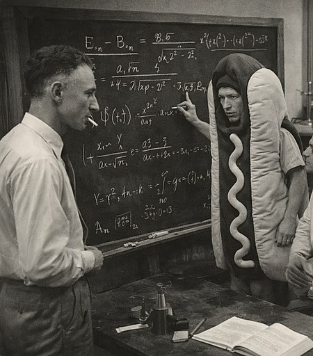
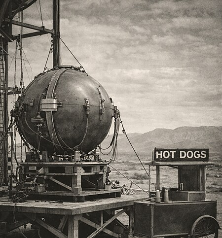
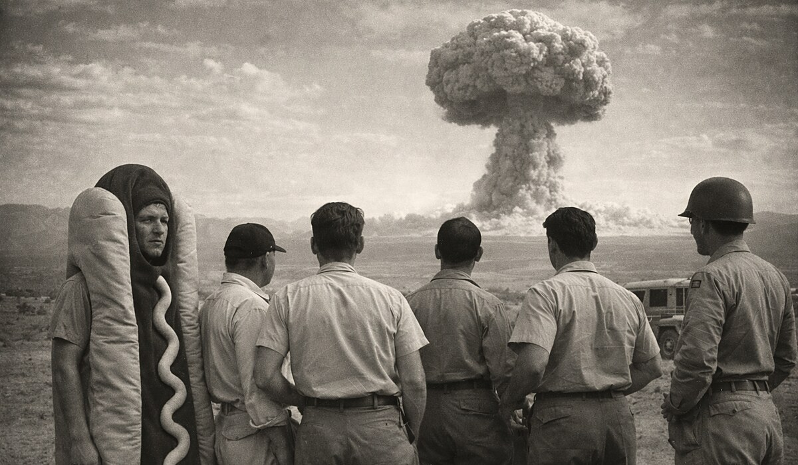
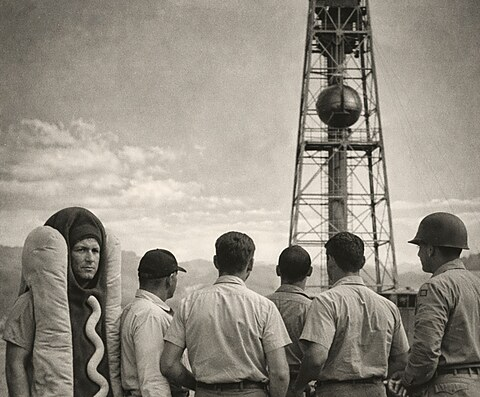
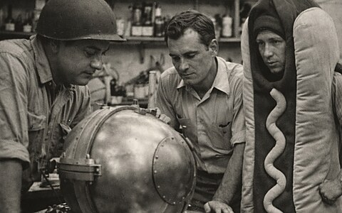
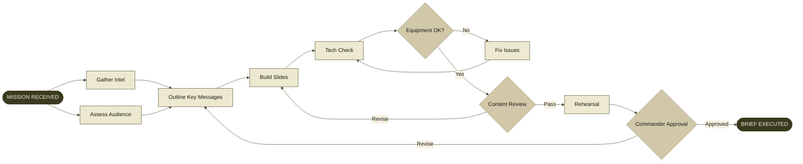
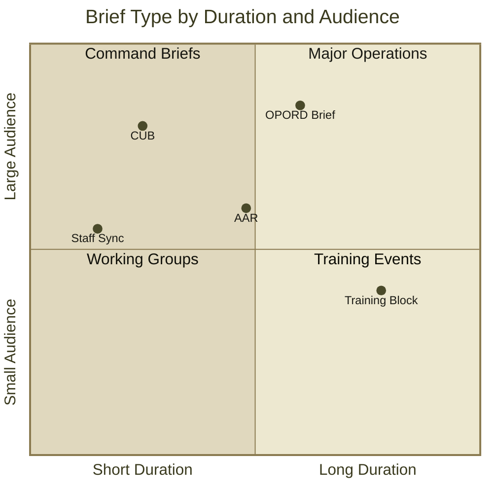
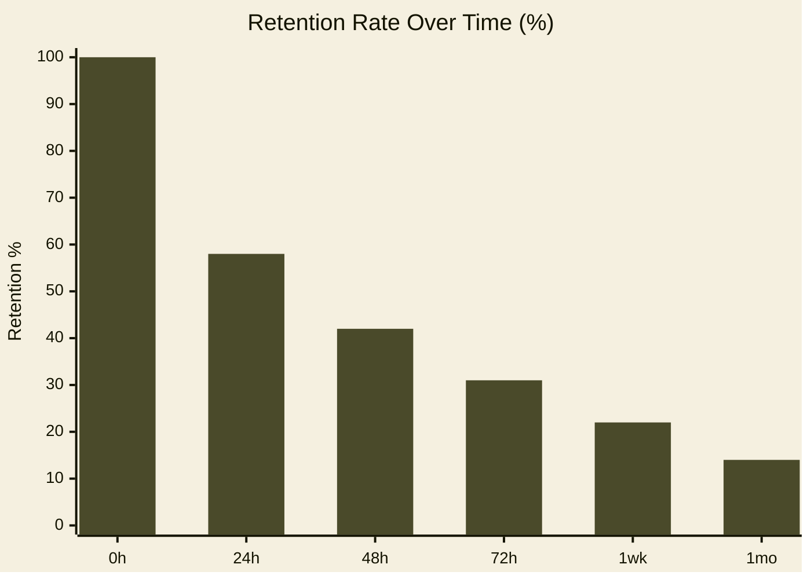

# Field Manual 
## A Slidev Theme for the Modern Presenter

<template v-slot:subtitle>

CPT John Q. Presenter · Department of the Presentation

</template>

<!--
Hello, my name is PJ Doland. Today I'm going to walk you through the Field Manual theme for Slidev.

I built this theme for a project I'm working on right now. I wanted something inspired by vintage military document design. I couldn't find anything that fit the bill, so I developed this from scratch. And now I've decided to share it with the community.

The design draws from US Army field manuals — the FM series, published from roughly the 1950s through the 1980s. If you've ever looked through one of those booklets, the visual language is immediately recognizable: aged cream paper, bold condensed gothic headings, simple layout, and horizontal rules. It's a typographic system that evolved for maximum clarity under demanding conditions — field use, poor lighting, readers who need to find information fast. That combination of authority and practicality turns out to translate quite well to presentations.

The theme covers 24 different layouts. There's also a dark color scheme, but today we're just going to look at the light version. Let's go.
-->

---
layout: table-of-contents
docNumber: FM 24-SLIDE
sectionNumber: TOC
title: TABLE OF CONTENTS
---

<div class="toc-entry toc-entry--chapter">
  <span class="toc-entry-num">CH. 1</span>
  <span class="toc-entry-title">Fundamentals of the Briefing Room</span>
  <span class="toc-leaders"></span>
  <span class="toc-entry-page">3</span>
</div>
<div class="toc-entry">
  <span class="toc-entry-num">1-1</span>
  <span class="toc-entry-title">Purpose and Scope</span>
  <span class="toc-leaders"></span>
  <span class="toc-entry-page">3</span>
</div>
<div class="toc-entry">
  <span class="toc-entry-num">1-2</span>
  <span class="toc-entry-title">Equipment and Materiel</span>
  <span class="toc-leaders"></span>
  <span class="toc-entry-page">5</span>
</div>
<div class="toc-entry toc-entry--chapter">
  <span class="toc-entry-num">CH. 2</span>
  <span class="toc-entry-title">Tactical Use of Slides</span>
  <span class="toc-leaders"></span>
  <span class="toc-entry-page">8</span>
</div>
<div class="toc-entry">
  <span class="toc-entry-num">2-1</span>
  <span class="toc-entry-title">Slide Discipline and Sequence</span>
  <span class="toc-leaders"></span>
  <span class="toc-entry-page">8</span>
</div>
<div class="toc-entry">
  <span class="toc-entry-num">2-2</span>
  <span class="toc-entry-title">Callout Boxes and Warning Notices</span>
  <span class="toc-leaders"></span>
  <span class="toc-entry-page">11</span>
</div>
<div class="toc-entry toc-entry--chapter">
  <span class="toc-entry-num">CH. 3</span>
  <span class="toc-entry-title">Technical Listings and Code Displays</span>
  <span class="toc-leaders"></span>
  <span class="toc-entry-page">14</span>
</div>
<div class="toc-entry">
  <span class="toc-entry-num">3-1</span>
  <span class="toc-entry-title">Installation Procedures</span>
  <span class="toc-leaders"></span>
  <span class="toc-entry-page">14</span>
</div>
<div class="toc-entry">
  <span class="toc-entry-num">A-1</span>
  <span class="toc-entry-title">Appendix A — Reference Tables</span>
  <span class="toc-leaders"></span>
  <span class="toc-entry-page">22</span>
</div>

<!--
A table of contents does more than list what's coming. It signals that the presentation has structure. People relax when they can see the shape of something before it starts.

It gives the audience a reference point. They know where they are, and what's still ahead. For longer decks, that orientation matters.

Managing this slide is straightforward. Each entry is a small block of HTML in the markdown file. Add a row, remove one, change a page number. It takes seconds.
-->

---
layout: section
sectionNumber: '1'
docNumber: FM 24-SLIDE
---

# Chapter 1
## Fundamentals of the Briefing Room

<template v-slot:descriptor>
An introduction to purpose, scope, and the basic materiel required for effective presentation operations.
</template>

<!--
This is the section divider layout. It's intentionally bold and simple: the chapter number in small text above, the chapter title in large display type below, and a short descriptor underneath. The heading hierarchy here is actually inverted from the cover slide — on the cover, the large text is the document title; here it's the chapter title. That reversal is intentional and gives the two layout types a visual relationship without looking identical.

These dividers function as structural pauses — a moment for the audience to close one mental chapter and open the next. You'll see several as we move through the deck.
-->

---
layout: default
title: 1-1. PURPOSE AND SCOPE
sectionNumber: 1-1
docNumber: FM 24-SLIDE
---

## 1-1. PURPOSE AND SCOPE

This manual establishes doctrine for **operations in the briefing room**. It covers the preparation, execution, and follow-on actions required to deliver an effective slide-based presentation under field conditions.

**Applicability.** This manual applies to all personnel who are required to brief commanders, staff officers, or civilian counterparts using visual presentation software.

- The presenter is responsible for **slide discipline** at all times
- Content must be **legible at distance** — minimum 18pt body text at 1080p
- Classify each slide appropriately using the header/footer banner system
- Number all figures using the **FIG. X — LABEL** convention
- Maintain **section numbering** (1-1, 1-2, A-3) throughout the document

<!--
This is the default layout. It is the primary workhorse of the Field Manual theme. Everything in the content area on this slide is just plain Markdown. There is no custom HTML or special wrappers.

The header and footer populate automatically from a handful of values you set in the front matter. That metadata flows through consistently on every slide without any per-slide work.
-->

---
layout: default
title: 1-2. EQUIPMENT AND MATERIEL
sectionNumber: 1-2
docNumber: FM 24-SLIDE
---

## 1-2. EQUIPMENT AND MATERIEL

The following table identifies standard equipment for a field briefing:

| ITEM | NSN | QTY | REMARKS |
|------|-----|-----|---------|
| Laptop Computer | 7025-01-555-1234 | 1 | Min 8GB RAM |
| Projector, Data | 6730-01-444-5678 | 1 | 2000 lm min |
| HDMI Cable, 6ft | 5995-01-333-9012 | 2 | Redundant |
| Laser Pointer | 6230-01-222-3456 | 1 | Class IIIa max |
| Extension Cord | 6150-01-111-7890 | 1 | Grounded |

**COROLLARY.** Always conduct an equipment check no less than 15 minutes prior to the scheduled brief time. Failure to comply with this paragraph has historically led to catastrophic briefing failures at the O-6 level.

<!--
This is the same default layout, but this time with a Markdown table. Tables get a treatment that feels native to the aesthetic — monospace column headers in all-caps, consistent column alignment, and understated borders that don't fight with the paper background. No wrapper or special component is required. You can just write a standard Markdown table.
-->

---
layout: image-right
title: 1-3. TERRAIN APPRECIATION
sectionNumber: 1-3
docNumber: FM 24-SLIDE
figNumber: 1-1
figLabel: THE BRIEFING ROOM — STANDARD CONFIGURATION
---

## 1-3. Terrain Appreciation

Understanding the **physical layout** of the briefing room is essential to effective presentation. Key terrain features include:

- **Projection surface** — the screen or wall upon which slides are displayed
- **Lectern** — the primary firing position for the presenter
- **Dead ground** — areas where audience members cannot see the screen
- **Egress routes** — identified prior to briefing, for use in emergency

The standard briefing room seats 12–24 personnel in a classroom configuration. Avoid placing the lectern between the projector and screen.

<template v-slot:image>

</template>

<!--
The image-right layout gives you a text column on the left and an image panel on the right. The figure caption, that FIG. 1-1 label below the image, comes from two values set in the front matter: a figure number and a label. The layout renders them in a standardized format automatically.

If you're building a deck with a lot of figures across many slides, they all come out with exactly the same typographic treatment without any manual management. It also makes them easy to cross-reference in the body text.
-->

---
layout: image-left
title: 1-4. OPERATOR POSITIONING
sectionNumber: 1-4
docNumber: FM 24-SLIDE
figNumber: 1-2
figLabel: PRESENTER AT LECTERN — SIDE VIEW
---

## 1-4. Operator Positioning

The presenter shall **stand to the left of the screen** (from the audience's perspective) to avoid blocking projected content with their body.

Maintain a **45-degree angle** to the screen, allowing simultaneous eye contact with the audience and reference to displayed information.

- Do not turn your back to the audience
- Gesture toward the screen with an **open hand**, not a pointed finger
- Voice projection: maintain a level of **75–85 dB** at 10 meters
- Avoid rocking, pacing, or excessive hand movements

<template v-slot:image>

</template>

<!--
As you would expect, the image-left layout is the mirror of image-right. You can switch between the two layouts by changing a single word in the front matter. Everything else — content, captions, figure numbers — carries over unchanged.

Usually I decide between the two layouts based on the composition of the image.
-->

---
layout: image-full
docNumber: FM 24-SLIDE
classification: FOR TRAINING USE ONLY
---

<template v-slot:image>

</template>

# The Fog of the Briefing Room

<template v-slot:subtitle>
Clarity is a force multiplier. Every unclear slide costs command decisions.
</template>

<!--
The image-full layout strips away almost all the structural chrome. There is no header, no footer, and no section numbers. It lets the photograph fill the entire frame. A gradient behind the title text ensures legibility regardless of what the image contains. There are two content slots: a main title in large display type and a subtitle for a supporting line beneath it.

Use this for transition moments between chapters, for dramatic context-setting before a major section, or as a visual reset to recapture the audience's attention. It's punctuation rather than content delivery. The absence of structure is the point.
-->

---
layout: image-top
title: 1-5. VISUAL AIDS AND GRAPHIC INTELLIGENCE
sectionNumber: 1-5
docNumber: FM 24-SLIDE
figNumber: 1-3
figLabel: MILS CONVERSION CHART — APPROXIMATE VALUES
---

Images and diagrams transmit information **faster than text** under combat conditions. Use visual aids whenever the subject matter permits.

- Photographs: filter to 90% saturation for print legibility
- Diagrams: use thick lines (2pt minimum) for key elements
- Maps: include **scale bar** and **north arrow** on all tactical graphics
- Charts: label axes in ALL CAPS, include unit of measure

<template v-slot:image>

</template>

<!--
The image-top layout places a photograph in a horizontal band across the upper portion of the slide, with the content area below. The figure caption sits between the image and the text, in the same standardized format as the other image layouts.

This arrangement works well when the visual establishes the subject and the text provides the analysis. The eye naturally moves from image to caption to content. It's the same reading pattern you would find in a magazine or textbook spread.
-->

---
layout: image-bottom
title: 1-6. TERRAIN MODEL EMPLOYMENT
sectionNumber: 1-6
docNumber: FM 24-SLIDE
figNumber: 1-4
figLabel: SAND TABLE — OPERATIONAL AREA DETAIL
---

## 1-6. Terrain Model Employment

The terrain model (commonly "sand table") may be photographed and incorporated into slides for area studies and route analysis. Use high-contrast lighting to maximize relief definition.

**Key considerations:**
- Photograph from directly overhead at a consistent height
- Include a scale reference object (ruler, coin) in the frame
- Label key terrain features before photographing

<template v-slot:image>

</template>

<!--
The image-bottom layout inverts that order, rendering the text above and the image below. Use it when the argument needs to come first and the photograph is the evidence that lands at the end — the visual conclusion at the bottom of the slide rather than the premise at the top.
-->

---
layout: two-images
title: 1-7. BEFORE AND AFTER — SLIDE IMPROVEMENT
sectionNumber: 1-7
docNumber: FM 24-SLIDE
fig1Number: 1-5
fig1Label: BEFORE — UNFORMATTED SLIDE
fig2Number: 1-6
fig2Label: AFTER — FIELD MANUAL TREATMENT
---

The following comparison illustrates the improvement achieved by applying proper field manual formatting discipline to an otherwise adequate slide.

<template v-slot:image1>

</template>

<template v-slot:image2>

</template>

<!--
The two-images layout is the sixth, and final image based layout. It places two image panels side by side, each with its own independent figure caption. A shared text area above both panels provides context or framing for the pair. The natural use is before-and-after comparisons, paired photographs, or two reference diagrams that need to be seen together.

The two figure captions are numbered and labeled independently, which keeps each one citable individually in the text.
-->

---
layout: section
sectionNumber: '2'
docNumber: FM 24-SLIDE
---

# Chapter 2
## Tactical Use of Slides

<template v-slot:descriptor>
Doctrine for slide sequencing, content density, callout box employment, and the Warning/Caution/Note system.
</template>

<!--
Here you can see the same section divider layout. It has the same visual treatment. Only the content changes. By now that consistent rhythm should be working as intended: you see this layout and you know immediately a new section is beginning, without having to consciously process it. That kind of structural legibility is one of the things the field manual typographic tradition does really well. Everything has a clear place in the hierarchy, and the patterns are predictable enough to be navigated without effort.
-->

---
layout: statement
sectionNumber: 2-0
---

"One slide, one idea. Never shall the briefer compound two concepts upon a single frame, lest the commander be confused and the mission suffer."

<!--
The statement layout strips everything unnecessary away. There is no header, footer, or section numbers. It presents a single piece of text in large display type, centered on the slide. Unlike the quote layout coming up later, there's no attribution on this layout. This is a direct assertion, not a citation.

Use it sparingly. The impact comes from contrast with the content-dense slides around it. If you put one between every section it becomes wallpaper. Save it for the one thing you most want the audience to carry out of the room.
-->

---
layout: default
title: 2-1. SLIDE DISCIPLINE
sectionNumber: 2-1
docNumber: FM 24-SLIDE
---

## 2-1. SLIDE DISCIPLINE

Slide discipline is the systematic control of slide content to ensure information density remains within the cognitive capacity of the audience.

**Rule of Six.** No slide shall contain more than six primary bullet points. No bullet point shall exceed two lines of text.

**The Single-Idea Principle.** Each slide communicates exactly one primary idea. Supporting points clarify or expand that idea; they do not introduce new ones.

**Sequence Logic.** Slides shall progress from:
1. **Situation** — What is happening
2. **Mission** — What we are doing about it
3. **Execution** — How we are doing it
4. **Service Support** — What we need
5. **Command and Signal** — How we communicate

<!--
Back to the default layout. This slide mixes prose paragraphs, bold inline definition labels, and a numbered list. This is a combination that appears constantly in actual field manuals. The typographic spacing between paragraphs and list items is handled by the theme's CSS, so the vertical rhythm stays consistent as the content varies. You don't have to nudge anything.
-->

---
layout: two-column
title: 2-2. CONTENT DENSITY COMPARISON
sectionNumber: 2-2
docNumber: FM 24-SLIDE
---

<template v-slot:left>

## COMPLIANT

- One clear idea per bullet
- Action-oriented language
- Concrete nouns, active verbs
- Specific quantities cited
- Date/time in military format
- Classification per slide

</template>

<template v-slot:right>

## NON-COMPLIANT

- Multiple ideas crammed together requiring the audience to parse complex compound sentences
- Passive voice constructions that obscure agency and responsibility
- Vague attributions ("studies show")
- Missing units, dates, or sources
- Font sizes below 18pt
- Unmarked sensitive material

</template>

<!--
The two-column layout splits the content area into two equal halves with a dividing rule between them. Each column accepts any Markdown content: bullets, prose, headings, or whatever else you might need. It's a general-purpose layout for anything that naturally falls into two parallel streams of content: two phases of a process, two sets of criteria, or two bodies of supporting detail.

Column headings use the same stroke-line treatment as section headings elsewhere in the theme, which keeps the typographic hierarchy consistent across layout types without any extra styling. If what you actually want is a deliberate point-counterpoint with labeled, color-accented panels, the comparison layout coming up in a few slides is the better fit for that use case.
-->

---
layout: three-column
title: 2-3. THE THREE PHASES OF PREPARATION
sectionNumber: 2-3
docNumber: FM 24-SLIDE
col1Header: PHASE I — RECONNAISSANCE
col2Header: PHASE II — CONSTRUCTION
col3Header: PHASE III — REHEARSAL
---

<template v-slot:col1>

- Gather source material
- Identify key messages (max 3)
- Assess audience knowledge level
- Determine classification requirements
- Identify time constraints

</template>

<template v-slot:col2>

- Draft outline in section format
- Build each slide bottom-up
- Apply FM typography standards
- Insert visual aids and figures
- Number all elements sequentially

</template>

<template v-slot:col3>

- Brief to a stand-in audience
- Time each section individually
- Identify dead spots (>30 sec without slide change)
- Correct all errors before live brief
- Confirm all equipment operational

</template>

<!--
This is the three-column layout. Each column gets a labeled header set in the front matter, separate from any headings you put inside the column content itself. The headers render in a smaller, monospace style to signal they're organizational labels rather than content headings.

Three columns is about the practical limit for this slide aspect ratio. Past that, the line lengths get too short to read comfortably. This works well for phase breakdowns, parallel processes, or any content that naturally comes in threes.
-->

---
layout: callout
title: 2-4. HAZARDOUS CONDITIONS
sectionNumber: 2-4
docNumber: FM 24-SLIDE
calloutType: warning
calloutTitle: WARNING — SLIDE OVERLOAD
---

## 2-4. Hazardous Conditions

Several conditions are known to degrade presentation effectiveness to a dangerous degree. The briefer must monitor for these conditions and take immediate corrective action.

**Text overload** occurs when a single slide contains more than 80 words. The audience shifts from listening to reading, causing the presenter to lose direct communication.

**Font fragmentation** occurs when more than three distinct typefaces are employed on a single slide. This condition creates visual noise that degrades comprehension.

<template v-slot:callout>

**DEATH BY POWERPOINT IS A REAL THREAT.** More commanders have been put to sleep by slide overload than by any external adversary. Maintain slide discipline at all times. The MSRD (Maximum Safe Reading Distance) for slides is 10 meters at 24pt.

</template>

<!--
The callout layout adds a prominent alert box to a slide that also has regular text content above it. There are four types with standardized meanings: Warning in red — the most serious, for conditions that can cause real harm if ignored. Caution in amber — for conditions requiring care. Note in blue — for supplementary information worth calling out. Important in olive — for things that need attention but don't rise to a warning level.

Each type gets a distinct color treatment, so the severity is readable at a glance without having to read the label. The box occupies the lower portion of the content area with the supporting prose above it. Coming up in the appendix, you'll also see the standalone Callout component, which lets you place any of these inline within regular slide content.
-->

---
layout: comparison
title: 2-5. APPROACH ANALYSIS
sectionNumber: 2-5
docNumber: FM 24-SLIDE
leftHeader: OPTION ALPHA — MINIMAL SLIDES
rightHeader: OPTION BRAVO — COMPREHENSIVE DECK
leftAccent: red
rightAccent: blue
---

<template v-slot:left>

**Advantages:**
- Short preparation time
- Forces presenter to know material cold
- Lower cognitive load on audience
- Easier to adapt in real time

**Disadvantages:**
- Less reference material for audience
- Difficult for complex technical subjects
- May appear under-prepared to senior leaders

**Verdict:** Recommended for operational briefings under time pressure.

</template>

<template v-slot:right>

**Advantages:**
- Complete reference for audience take-away
- Reduces speaker's need for memorization
- Suitable for technical procedures
- Provides documentation record

**Disadvantages:**
- High preparation time
- Presenter may read slides instead of brief
- Audience disengagement risk

**Verdict:** Appropriate for classroom instruction and technical training.

</template>

<!--
The comparison layout creates two labeled panels for side-by-side analysis. Each panel has its own header and an accent color which is applied to the panel's top border and label area. That color differentiation lets you signal the relationship between the two options before the audience reads a word: red for risk or disadvantage, blue for a procedural or neutral option, or olive for something recommended.

It's structurally similar to the two-column layout but with more visual weight between the panels, which makes it better suited for deliberate point-counterpoint content where the contrast between the two sides is the message.
-->

---
layout: quote
attribution: Gen. Jack D. Ripper
rank: CG, Burpelson Air Force Base
unit: 843rd Bomb Wing
sectionNumber: 2-6
---

"I can no longer sit back and allow Communist infiltration, Communist indoctrination, Communist subversion, and the international Communist conspiracy to sap and impurify all of our precious bodily fluids."

<!--
The quote layout presents a quotation in large display type with a citation line below it for name, title, and affiliation. The attribution is what distinguishes it from the statement layout. Here someone is being quoted. On a statement layout slide you're making a direct assertion as the presenter.
-->

---
layout: section
sectionNumber: '3'
docNumber: FM 24-SLIDE
---

# Chapter 3
## Technical Listings and Code Displays

<template v-slot:descriptor>
Procedures for incorporating technical code, configuration listings, and command-line procedures into field briefings.
</template>

<!--
Chapter three covers the more technically involved layouts: code panels with syntax highlighting, Mermaid diagram integration, and mathematical notation via KaTeX. These aren't things every presentation needs, but when you do need them, having a layout designed for them makes a real difference versus trying to embed a screenshot or paste in an image. Let's look at what's available.
-->

---
layout: code-full
title: 3-1. INSTALLATION PROCEDURE
codeTitle: LISTING 3-1 — INSTALLATION PROCEDURE
codeLang: bash
sectionNumber: 3-1
docNumber: FM 24-SLIDE
---

```bash
# FM 24-SLIDE — INSTALLATION PROCEDURE

# Step 1: Verify prerequisites
node --version          # v18.0 or higher
npm --version           # v8.0 or higher
git --version           # any version

# Step 2: Install Slidev globally
npm install -g @slidev/cli

# Step 3: Install the Field Manual theme
npm install slidev-theme-field-manual

# Step 4: Create new presentation
npm init slidev@latest my-briefing && cd my-briefing

# Step 5: Set theme: slidev-theme-field-manual in slides.md
npm run dev             # http://localhost:3030
```

<template v-slot:caption>
SOURCE: FM 24-SLIDE, PARA 3-1 — VERIFIED ON LINUX/MACOS/WINDOWS (WSL2)
</template>

<!--
The code-full layout dedicates the entire content area to a syntax-highlighted code panel — title bar across the top, optional caption below, and the listing in between. The code itself is written as a standard fenced code block directly in the slide body.

Syntax highlighting uses a custom Shiki theme built around the paper color palette: warm ink on aged paper rather than the high-contrast blues and purples of a typical dark-mode editor. The result is code that reads as part of the document rather than something imported from a different environment.
-->

---
layout: code-right
title: 3-2. SLIDE FRONT MATTER
codeTitle: LISTING 3-2 — FRONT MATTER CONFIG
codeLang: yaml
sectionNumber: 3-2
docNumber: FM 24-SLIDE
---

## 3-2. Slide Front Matter

The **front matter block** is the primary configuration interface for a Slidev presentation. It appears at the top of `slides.md` and controls theme selection, typography, color schema, and syntax highlighting.

Key parameters for the field manual theme:

- `theme` — set to `slidev-theme-field-manual`
- `colorSchema` — `light` (aged paper) or `dark` (night map)
- `highlighter` — must be set to `shiki`
- `lineNumbers` — enable globally here or per-code-block

<template v-slot:code>

```yaml
---
theme: slidev-theme-field-manual
title: 'FM 00-0: Your Briefing Title'
author: 'HQ, Your Organization'
colorSchema: light
highlighter: shiki
lineNumbers: true

# Field Manual theme options
docNumber: FM 00-0
unit: 1st PRES BDE, 3rd SLIDE DIV
classification: FOR TRAINING USE ONLY

fonts:
  sans: Source Serif 4
  mono: Courier Prime
---
```

</template>

<template v-slot:caption>
LISTING 3-2 — REPLACE PLACEHOLDERS WITH OPERATIONAL VALUES
</template>

<!--
The code-right layout splits the slide into explanatory text on the left and a code panel on the right — the same structural idea as the image-right layout, just with a code panel instead of a photograph. The split is roughly 50/50.

This is the layout for technical walkthroughs where the explanation and the listing need to be visible simultaneously. The audience shouldn't have to hold one in memory while reading the other — putting them side by side reduces the cognitive load.
-->

---
layout: default
title: 3-3. CODE BLOCK COMPONENT
sectionNumber: 3-3
docNumber: FM 24-SLIDE
---

## 3-3. The CodeBlock Component

The `<CodeBlock>` component provides styling for inline code displays on any layout. It accepts the following props:

| PROP | TYPE | DEFAULT | DESCRIPTION |
|------|------|---------|-------------|
| `lang` | string | — | Language identifier (bash, python, js, yaml…) |
| `title` | string | — | Title bar text (ALL CAPS by convention) |
| `lineNumbers` | boolean | true | Show line number gutter |
| `rulers` | boolean | false | Faint rule every 5 lines |
| `caption` | string | — | Footer caption text |

<CodeBlock lang="python" title="LISTING 3-3 — EXAMPLE PYTHON PROCEDURE" :lineNumbers="true">

```python
def calculate_slide_density(words: int, bullets: int) -> str:
    """Assess slide content load — FM 24-SLIDE para 2-1."""
    density = words / max(bullets, 1)
    if density > 20: return "NON-COMPLIANT — reduce word count"
    return "MARGINAL — review recommended" if density > 12 else "COMPLIANT"
```

</CodeBlock>

<!--
If you need a code panel on a slide that isn't using a dedicated code layout — say, alongside a table or some prose on the default layout — the CodeBlock component lets you place one inline. It accepts a language identifier for syntax highlighting, a title for the header bar, and optional features like line numbers and ruler lines every five rows.

The visual treatment is identical to the dedicated code layouts. Whether code appears in a full-layout panel or an inline component, it looks the same. That consistency across contexts is part of what makes the theme feel cohesive rather than assembled from parts.
-->

---
layout: code-right
title: 3-4. JAVASCRIPT CONFIGURATION
codeTitle: LISTING 3-4 — SLIDEV CONFIG
codeLang: javascript
sectionNumber: 3-4
docNumber: FM 24-SLIDE
---

## 3-4. Advanced Configuration

The `vite.config.ts` and `setup/` directory allow deep customization of the theme. Use these only when standard front matter options are insufficient.

**When to use custom config:**
- Override specific CSS custom properties for a single presentation
- Register additional Vue components
- Modify the Shiki theme color map
- Add custom slide transitions

**Warning:** Modifying `setup/shiki.ts` overrides the entire theme color map. Use `vite.config.ts` to add properties without destructive replacement.

<template v-slot:code>

```javascript
// vite.config.ts — Override theme tokens
import { defineConfig } from 'vite'

export default defineConfig({
  slidev: {
    // Override specific CSS custom properties
  },
  css: {
    preprocessorOptions: {
      css: {
        additionalData: `
          :root {
            /* Override: use unit red instead of signal red */
            --c-red: #6b0000;
          }
        `
      }
    }
  }
})
```

</template>

<!--
This is another code-right layout slide, this time with JavaScript. The language identifier in the front matter drives syntax highlighting independently for each slide — you can mix YAML, Bash, Python, JavaScript, and anything else Shiki supports freely across the deck without any global changes.

This particular slide is also mildly recursive: a presentation about a presentation tool, showing you how to configure the tool that's currently presenting it. Which is either charming or dizzying, depending on your tolerance for that kind of thing.
-->

---
layout: chart-full
title: 3-5. MERMAID DIAGRAM INTEGRATION
sectionNumber: 3-5
docNumber: FM 24-SLIDE
figNumber: 3-1
figLabel: BRIEFING WORKFLOW — GENERATED INLINE FROM MERMAID
---

<template v-slot:chart>



</template>

<template v-slot:source>
SOURCE: MERMAID.JS — RENDERED NATIVELY — NO EXTERNAL TOOLS OR IMAGE EXPORTS REQUIRED
</template>

<!--
Mermaid is a diagram-as-code library that Slidev renders natively in the browser. You write diagram syntax in a code fence and it renders as a vector diagram at presentation time — no image exports, no external services, no build step. The chart-full layout gives that diagram the entire content area, with a figure caption below and an optional source credit.

The global front matter in this deck pre-configures Mermaid's color variables to match the paper palette. That's what makes the diagram look native to the slide rather than imported from a white-background flowchart tool. You can also add per-diagram overrides in the Mermaid init block for cases where you need more precise control over a specific chart.
-->

---
layout: chart-right
title: 3-6. SUPPORTED CHART TYPES
sectionNumber: 3-6
docNumber: FM 24-SLIDE
figNumber: 3-2
figLabel: BRIEF TYPE MATRIX — MERMAID QUADRANTCHART
---

## 3-6. Supported Chart Types

This theme includes **native Mermaid support** via Slidev's built-in renderer. Diagrams are declared as fenced ` ```mermaid ` code blocks in markdown.

**Supported diagram types:**

- **`flowchart`** — Process flows, decision trees
- **`quadrantChart`** — Two-axis classification matrices
- **`xychart-beta`** — Bar and line charts
- **`sequenceDiagram`** — Interaction and message flows
- **`gantt`** — Timeline and schedule displays
- **`mindmap`** — Hierarchical concept maps

<template v-slot:chart>



</template>


<!--
The chart-right layout places explanatory text on the left and a Mermaid diagram on the right — the same split as the code-right layout, applied to charts. This slide demonstrates the quadrantChart type, which is useful for two-axis classification matrices.

Mermaid supports a fairly wide range of diagram types: flowcharts and decision trees, quadrant matrices, sequence diagrams for interaction flows, Gantt charts for schedules and timelines, mindmaps, and bar and line charts via the xychart renderer. You pick the diagram type by changing the first keyword inside the code fence.
-->

---
layout: chart-left
title: 3-7. DECLARING INLINE CHARTS
sectionNumber: 3-7
docNumber: FM 24-SLIDE
figNumber: 3-3
figLabel: RETENTION DECAY — MERMAID XYCHART-BETA
---

## 3-7. Declaring Inline Charts

Charts are declared directly in slide markdown. Place a fenced Mermaid block inside a `<template v-slot:chart>` tag within any `chart-full`, `chart-right`, or `chart-left` layout.

**Theming.** Set `mermaid: theme: base` in your global front matter and supply `themeVariables` to match your palette. Per-diagram overrides use the `%%{init}%%` directive at the top of each block.

```
xychart-beta
  title "Retention Rate (%)"
  x-axis ["0h","24h","72h","1wk"]
  y-axis "Retention %" 0 --> 100
  bar [100, 58, 31, 22]
```

<template v-slot:chart>



</template>


<!--
Chart-left is the mirror of chart-right. The xychart-beta type you see here is Mermaid's bar and line chart renderer. It's good for simple data visualization that doesn't require a full charting library.

Notice the text column includes a code fence showing the simplified chart syntax. You can pair a live diagram and the source that produces it on the same slide. This is useful when you're walking through how something works rather than just showing the output.
-->

---
layout: code-right
title: 3-8. LATEX MATHEMATICAL NOTATION
codeTitle: LISTING 3-8 — KATEX SYNTAX
codeLang: latex
sectionNumber: 3-8
docNumber: FM 24-SLIDE
---

## 3-8. LaTeX Mathematical Notation

Slidev renders mathematical notation natively via **KaTeX**. Enable it with `katex: true` in global front matter.

**Inline.** Wrap expressions in single dollar signs: the quadratic solution is $x = \frac{-b \pm \sqrt{b^2 - 4ac}}{2a}$.

**Display.** Double dollar signs produce a centred block.
Shannon entropy — a measure of information density per slide:

$$H(X) = -\sum_{i=1}^{n} p_i \log_2 p_i$$

Euler's identity, the most compact equation in mathematics:

$$e^{i\pi} + 1 = 0$$

<template v-slot:code>

```tex
# Enable in global front matter
# katex: true

# Inline (single $ … $)
$x = \frac{-b \pm \sqrt{b^2 - 4ac}}{2a}$.

# Display block (double $$ … $$)
$$
H(X) = -\sum_{i=1}^{n} p_i \log_2 p_i
$$
```
</template>

<!--
Slidev includes KaTeX for mathematical notation. Enable it in the global front matter and it's available on every slide. There is no build step or  external dependency at presentation time.

Inline expressions use single dollar signs and flow with surrounding body text. Display blocks use double dollar signs and render centered at full width. This slide uses the code-right layout to show the KaTeX source on the right while rendering the live equations on the left. It's a natural pairing for any notation system you're demonstrating to an audience that might want to reproduce it themselves.
-->

---
layout: dashboard
title: SITUATIONAL AWARENESS DISPLAY
sectionNumber: 3-9
docNumber: FM 24-SLIDE
panel1Label: SLIDES COMPLETED
panel2Label: TIME REMAINING
panel3Label: AUDIENCE ENGAGEMENT
panel4Label: EQUIPMENT STATUS
---

<template v-slot:panel1>

<div style="font-family: var(--font-heading); font-size: 3rem; font-weight: 900; color: var(--c-red); text-align: center;">
24/30
</div>
<div style="font-family: var(--font-mono); font-size: 0.7rem; text-align: center; color: var(--c-khaki-dark); letter-spacing: 0.1em;">
SLIDES · 80% COMPLETE
</div>

</template>

<template v-slot:caption1>PROGRESS: ON SCHEDULE</template>

<template v-slot:panel2>

<div style="font-family: var(--font-heading); font-size: 3rem; font-weight: 900; color: var(--color-fg-muted); text-align: center;">
12:34
</div>
<div style="font-family: var(--font-mono); font-size: 0.7rem; text-align: center; color: var(--c-khaki-dark); letter-spacing: 0.1em;">
MINUTES · REMAINING
</div>

</template>

<template v-slot:caption2>ETA: ON TIME</template>

<template v-slot:panel3>

<div style="font-family: var(--font-heading); font-size: 3rem; font-weight: 900; color: var(--c-blue); text-align: center;">
HIGH
</div>
<div style="font-family: var(--font-mono); font-size: 0.7rem; text-align: center; color: var(--c-khaki-dark); letter-spacing: 0.1em;">
OBSERVED STATUS
</div>

</template>

<template v-slot:caption3>NO SLEEPING OBSERVED</template>

<template v-slot:panel4>

<div style="font-family: var(--font-heading); font-size: 3rem; font-weight: 900; color: var(--color-fg-muted); text-align: center;">
NOMINAL
</div>
<div style="font-family: var(--font-mono); font-size: 0.7rem; text-align: center; color: var(--c-khaki-dark); letter-spacing: 0.1em;">
ALL SYSTEMS · GREEN
</div>

</template>

<template v-slot:caption4>PROJECTOR: OPERATIONAL</template>

<!--
The dashboard layout provides a four-panel grid — two columns, two rows — with a labeled header above each panel and an optional caption below. The panel labels come from the front matter. What goes inside each panel is entirely up to you: large numbers, status indicators, charts, custom styled text. The panels are neutral containers designed to get out of the way of whatever you put in them.

This is less of a narrative layout and more of a display board. It is good for status readouts, metrics summaries, or any content that's meant to be scanned rather than read linearly.
-->

---
layout: timeline
title: A-1. OPERATION SLIDE DRAGON — EVENT SEQUENCE
sectionNumber: A-1
docNumber: FM 24-SLIDE
direction: horizontal
---

<div class="tl-entry">
  <div class="tl-entry-marker"><div class="tl-entry-dot"></div></div>
  <div class="tl-entry-body">
    <div class="tl-entry-date fm-label">D-14</div>
    <div class="tl-entry-title">Initiation</div>
    <div class="tl-entry-desc">Brief assigned. Outline drafted.</div>
  </div>
</div>
<div class="tl-entry">
  <div class="tl-entry-marker"><div class="tl-entry-dot"></div></div>
  <div class="tl-entry-body">
    <div class="tl-entry-date fm-label">D-7</div>
    <div class="tl-entry-title">Recon</div>
    <div class="tl-entry-desc">Source material collected. Key messages identified.</div>
  </div>
</div>
<div class="tl-entry">
  <div class="tl-entry-marker"><div class="tl-entry-dot"></div></div>
  <div class="tl-entry-body">
    <div class="tl-entry-date fm-label">D-3</div>
    <div class="tl-entry-title">Build</div>
    <div class="tl-entry-desc">Slides constructed. Graphics inserted.</div>
  </div>
</div>
<div class="tl-entry">
  <div class="tl-entry-marker"><div class="tl-entry-dot"></div></div>
  <div class="tl-entry-body">
    <div class="tl-entry-date fm-label">D-1</div>
    <div class="tl-entry-title">Rehearsal</div>
    <div class="tl-entry-desc">Timed run-through. Corrections applied.</div>
  </div>
</div>
<div class="tl-entry">
  <div class="tl-entry-marker"><div class="tl-entry-dot"></div></div>
  <div class="tl-entry-body">
    <div class="tl-entry-date fm-label">D-Day</div>
    <div class="tl-entry-title">Execution</div>
    <div class="tl-entry-desc">Brief delivered. Commander satisfied.</div>
  </div>
</div>

<!--
The timeline layout renders events along a connecting line, each with a date marker, a title, and a short description. The connecting line runs either horizontally or vertically depending on a single front matter value — horizontal for fewer events with more content per entry, vertical when you have a longer sequence to display.

It's the most markup-intensive layout in the theme — each event is its own small HTML block rather than a simple Markdown list item — but that gives you precise control over each entry, including the ability to add custom content inside an entry if the situation calls for it.
-->

---
layout: default
title: A-2. COMPONENT REFERENCE — CODEBLOCK
sectionNumber: A-2
docNumber: FM 24-SLIDE
---

## A-2. CodeBlock Component Examples

The `CodeBlock` component used standalone, demonstrating YAML config:

<CodeBlock lang="yaml" title="LISTING A-1 — SLIDEV FRONT MATTER" :rulers="true">

```yaml
---
theme: slidev-theme-field-manual
colorSchema: light          # light | dark
highlighter: shiki
docNumber: FM 24-SLIDE
classification: FOR TRAINING USE ONLY
unit: 1st PRES BDE
---
```

</CodeBlock>

<!--
The appendix is a good place for reference examples. Here the CodeBlock component is shown with the rulers option enabled — faint horizontal lines every five rows inside the code panel. That's useful for dense reference listings where a reader might need to count lines or identify a position in a block.

This is also showing that the component works perfectly well inline on the default layout, mixed with prose above it. There's no requirement to use a dedicated code layout — the CodeBlock component is self-contained and can be placed anywhere.
-->

---
layout: default
title: A-3. CALLOUT BOX GALLERY
sectionNumber: A-3
docNumber: FM 24-SLIDE
---

## A-3. Callout Box Gallery

<Callout type="warning" title="WARNING">
Failure to apply proper slide classification markings constitutes a security violation under AR 380-5. All slides containing sensitive information must be marked at the highest level of sensitivity present.
</Callout>

<Callout type="caution" title="CAUTION">
Laser pointers shall not be aimed at personnel. Class IIIa and above pointers present an eye injury hazard.
</Callout>

<Callout type="note" title="NOTE">
The field manual template automatically applies paper grain, classification banners, and section numbering to all layouts. These elements may be overridden via CSS custom properties.
</Callout>

<Callout type="important" title="IMPORTANT">
All code listings in this manual have been tested on current production systems.
</Callout>

<!--
Here you can see all four callout types together for direct comparison. Warning in red — the most serious. Caution in amber — for things requiring care. Note in blue — supplementary information. Important in olive — worth attention, but not alarming.

The callout component here is the inline version. It is placed directly in the content flow on the default layout. Compare this to the callout layout from Chapter 2, which embeds a single callout as a structural element at the bottom of a slide that also has a full content column above it. Both use the same visual treatment.  Choose the layout version when the callout is the primary feature of the slide, and the inline component when it's one element among several.
-->

---
layout: end
docNumber: FM 24-SLIDE
classification: FOR TRAINING USE ONLY
unit: HQ, DEPT OF THE PRESENTATION
photo: ./assets/presenter.jpg
---

<template v-slot:title>Questions?</template>

<template v-slot:contact>

**CPT John Q. Presenter**
Operations Officer, 1st Presentation Brigade
john.q.presenter@pres.army.mil
DSN: 555-0100

</template>

<!--
The end layout is the closing slide. It has three slots: a title, a contact block, and a photo. The photo takes up the left side of the slide. The title sits prominently in the upper right. The contact block goes below it with whatever information you want to leave on the screen. This might include the presenter  name, title, email, or phone.

It gives the audience something to look at and reference while questions are being taken. More useful than a blank slide or a "Thank You" placeholder.

And that's Field Manual, with 24 layouts covering most of what you'll need for a structured presentation, tied together by a consistent design system and a visual language that's been refined over decades of real-world use.

If you work with Slidev, I'd also mention deck2video, which is another project of mine that pairs well with it. deck2video converts Markdown-based presentation decks, including Slidev decks, into narrated MP4 videos using local AI voice synthesis. It reads the speaker notes from your slides, generates narration from them using Chatterbox TTS — with optional voice cloning so the result sounds like you. It assembles everything into a finished video file. There's even an interactive review mode where you can listen to and approve the audio for each slide before the final render. No manual video editing, no cloud services, everything runs locally. You can find it at my github page.

Thanks for your time.
-->
