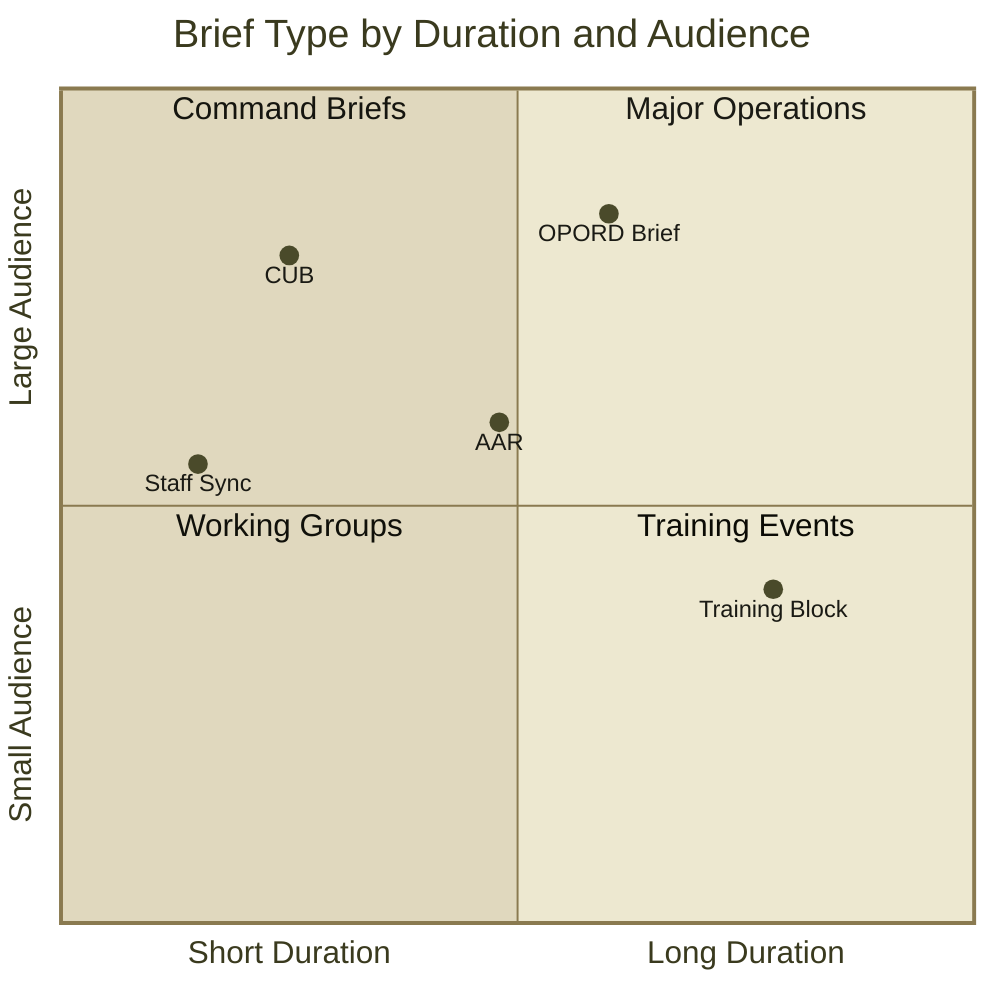
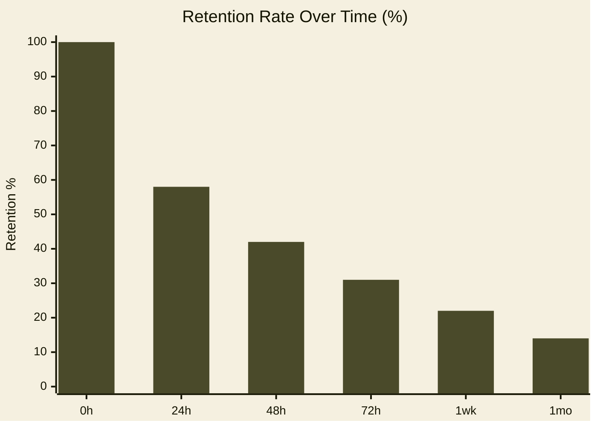

<!-- Slide 1 — Cover -->

# FM 24-SLIDE
## A Field Manual for the Modern Presenter

<template v-slot:subtitle>

CPT John Q. Presenter · Department of the Presentation

</template>

<!--
This is the cover layout — the entry point for every Field Manual theme presentation. The h1 renders in bold Oswald at a large size and the h2 sits beneath it in lighter weight, giving you a clear hierarchy between document designation and subtitle. The subtitle named slot puts arbitrary content below those headings — use it for presenter name, unit, or event details. All theme-wide metadata flows from front matter props: docNumber, date, and classification populate the header and footer automatically on every slide in the deck without any per-slide configuration.
-->

---
layout: table-of-contents
docNumber: FM 24-SLIDE
sectionNumber: TOC
title: TABLE OF CONTENTS
---

<div class="toc-entry toc-entry--chapter">
  <span class="toc-entry-num">CH. 1</span>
  <span class="toc-entry-title">Fundamentals of the Briefing Room</span>
  <span class="toc-leaders"></span>
  <span class="toc-entry-page">3</span>
</div>
<div class="toc-entry">
  <span class="toc-entry-num">1-1</span>
  <span class="toc-entry-title">Purpose and Scope</span>
  <span class="toc-leaders"></span>
  <span class="toc-entry-page">3</span>
</div>
<div class="toc-entry">
  <span class="toc-entry-num">1-2</span>
  <span class="toc-entry-title">Equipment and Materiel</span>
  <span class="toc-leaders"></span>
  <span class="toc-entry-page">5</span>
</div>
<div class="toc-entry toc-entry--chapter">
  <span class="toc-entry-num">CH. 2</span>
  <span class="toc-entry-title">Tactical Use of Slides</span>
  <span class="toc-leaders"></span>
  <span class="toc-entry-page">8</span>
</div>
<div class="toc-entry">
  <span class="toc-entry-num">2-1</span>
  <span class="toc-entry-title">Slide Discipline and Sequence</span>
  <span class="toc-leaders"></span>
  <span class="toc-entry-page">8</span>
</div>
<div class="toc-entry">
  <span class="toc-entry-num">2-2</span>
  <span class="toc-entry-title">Callout Boxes and Warning Notices</span>
  <span class="toc-leaders"></span>
  <span class="toc-entry-page">11</span>
</div>
<div class="toc-entry toc-entry--chapter">
  <span class="toc-entry-num">CH. 3</span>
  <span class="toc-entry-title">Technical Listings and Code Displays</span>
  <span class="toc-leaders"></span>
  <span class="toc-entry-page">14</span>
</div>
<div class="toc-entry">
  <span class="toc-entry-num">3-1</span>
  <span class="toc-entry-title">Installation Procedures</span>
  <span class="toc-leaders"></span>
  <span class="toc-entry-page">14</span>
</div>
<div class="toc-entry">
  <span class="toc-entry-num">A-1</span>
  <span class="toc-entry-title">Appendix A — Reference Tables</span>
  <span class="toc-leaders"></span>
  <span class="toc-entry-page">22</span>
</div>

<!--
The table-of-contents layout gives you a regulation-style ToC with dot leaders, section numbers, and a column header row. Entries are raw HTML divs rather than Markdown so you have full control over the grid. Apply the toc-entry--chapter modifier class to chapter-level rows — they get an olive background and bold Oswald treatment that distinguishes them from subsection entries. The dot leaders are pure CSS border-bottom, so they automatically stretch to fill whatever space exists between the title and the page number column regardless of title length.
-->

---
layout: section
sectionNumber: '1'
docNumber: FM 24-SLIDE
---

# Chapter 1
## Fundamentals of the Briefing Room

<template v-slot:descriptor>
An introduction to purpose, scope, and the basic materiel required for effective presentation operations.
</template>

<!--
The section layout creates a chapter divider slide. Notice the inverted heading hierarchy compared to the cover: h1 is the small, lightweight label ("Chapter 1") and h2 is the large, bold display title — exactly opposite of how they render on the cover slide. This mirroring is intentional and creates visual bookending across the deck. The descriptor slot holds a brief abstract in smaller body text below the title bar. Use these dividers as structural pauses between major chapters to give the audience a clear sense of where they are in a long brief.
-->

---
layout: default
title: 1-1. PURPOSE AND SCOPE
sectionNumber: 1-1
docNumber: FM 24-SLIDE
---

## 1-1. PURPOSE AND SCOPE

This manual establishes doctrine for **operations in the briefing room**. It covers the preparation, execution, and follow-on actions required to deliver an effective slide-based presentation under field conditions.

**Applicability.** This manual applies to all personnel who are required to brief commanders, staff officers, or civilian counterparts using visual presentation software.

- The presenter is responsible for **slide discipline** at all times
- Content must be **legible at distance** — minimum 18pt body text at 1080p
- Classify each slide appropriately using the header/footer banner system
- Number all figures using the **FIG. X — LABEL** convention
- Maintain **section numbering** (1-1, 1-2, A-3) throughout the document

<!--
The default layout is the primary workhorse of the theme — standard header, full-width content area, footer. Everything on this slide was written in plain Markdown with no custom HTML, named slots, or special wrappers. The title, sectionNumber, and docNumber props in the front matter populate the header automatically; the footer picks up the current slide number from Slidev's navigation context. The h2 here is classless, so it gets the global stroke-line treatment — a thick border above and a thinner one below — consistent with the theme's heading hierarchy throughout.
-->

---
layout: default
title: 1-2. EQUIPMENT AND MATERIEL
sectionNumber: 1-2
docNumber: FM 24-SLIDE
---

## 1-2. EQUIPMENT AND MATERIEL

The following table identifies standard equipment for a field briefing:

| ITEM | NSN | QTY | REMARKS |
|------|-----|-----|---------|
| Laptop Computer | 7025-01-555-1234 | 1 | Min 8GB RAM |
| Projector, Data | 6730-01-444-5678 | 1 | 2000 lm min |
| HDMI Cable, 6ft | 5995-01-333-9012 | 2 | Redundant |
| Laser Pointer | 6230-01-222-3456 | 1 | Class IIIa max |
| Extension Cord | 6150-01-111-7890 | 1 | Grounded |

**COROLLARY.** Always conduct an equipment check no less than 15 minutes prior to the scheduled brief time. Failure to comply with this paragraph has historically led to catastrophic briefing failures at the O-6 level.

<!--
Markdown tables render cleanly inside the default layout using the theme's base table styles — monospace header row, consistent column alignment, and understated borders that feel native to the paper background. No special layout or component is needed for tabular data; the default layout handles it out of the box. This is the same layout as the previous slide, demonstrating that the default layout covers a wide range of content types — from prose and bullets to structured tables.
-->

---
layout: image-right
title: 1-3. TERRAIN APPRECIATION
sectionNumber: 1-3
docNumber: FM 24-SLIDE
figNumber: 1-1
figLabel: THE BRIEFING ROOM — STANDARD CONFIGURATION
---

## 1-3. Terrain Appreciation

Understanding the **physical layout** of the briefing room is essential to effective presentation. Key terrain features include:

- **Projection surface** — the screen or wall upon which slides are displayed
- **Lectern** — the primary firing position for the presenter
- **Dead ground** — areas where audience members cannot see the screen
- **Egress routes** — identified prior to briefing, for use in emergency

The standard briefing room seats 12–24 personnel in a classroom configuration. Avoid placing the lectern between the projector and screen.

<template v-slot:image>

</template>

<!--
The image-right layout gives you a text column on the left with an image panel on the right. Pass figNumber and figLabel as front matter props — they automatically render a standardized figure caption below the image via the FigureCaption component, so all figures across your deck use the same "FIG. X — LABEL" format consistently. The image itself goes inside the image named slot using a plain img tag. The text column accepts standard Markdown with no special wrappers needed.
-->

---
layout: image-left
title: 1-4. OPERATOR POSITIONING
sectionNumber: 1-4
docNumber: FM 24-SLIDE
figNumber: 1-2
figLabel: PRESENTER AT LECTERN — SIDE VIEW
---

## 1-4. Operator Positioning

The presenter shall **stand to the left of the screen** (from the audience's perspective) to avoid blocking projected content with their body.

Maintain a **45-degree angle** to the screen, allowing simultaneous eye contact with the audience and reference to displayed information.

- Do not turn your back to the audience
- Gesture toward the screen with an **open hand**, not a pointed finger
- Voice projection: maintain a level of **75–85 dB** at 10 meters
- Avoid rocking, pacing, or excessive hand movements

<template v-slot:image>

</template>

<!--
The image-left layout is the exact mirror of image-right — same props, same slot names, image panel on the left. Use image-left when the visual provides context and the text follows from it, or simply when your photograph's composition reads better left to right. Both layouts share identical prop names and slot structure, so you can swap between them with a single front matter change and all content carries over with no other edits needed.
-->

---
layout: image-full
docNumber: FM 24-SLIDE
classification: FOR TRAINING USE ONLY
---

<template v-slot:image>

</template>

# The Fog of the Briefing Room

<template v-slot:subtitle>
Clarity is a force multiplier. Every unclear slide costs command decisions.
</template>

<!--
The image-full layout is for maximum visual impact — the image fills the entire slide frame with no header or footer chrome. Title text and a subtitle overlay the image via named slots; the layout adds a translucent dark gradient to ensure legibility on any image. Use this for transition moments between chapters, dramatic reveals, or as a visual interlude to reset the audience's attention. It's intentionally stripped of all structural chrome — no section numbers, no doc number — so it functions as a beat in the information flow rather than a data delivery point.
-->

---
layout: image-top
title: 1-5. VISUAL AIDS AND GRAPHIC INTELLIGENCE
sectionNumber: 1-5
docNumber: FM 24-SLIDE
figNumber: 1-3
figLabel: MILS CONVERSION CHART — APPROXIMATE VALUES
---

Images and diagrams transmit information **faster than text** under combat conditions. Use visual aids whenever the subject matter permits.

- Photographs: filter to 90% saturation for print legibility
- Diagrams: use thick lines (2pt minimum) for key elements
- Maps: include **scale bar** and **north arrow** on all tactical graphics
- Charts: label axes in ALL CAPS, include unit of measure

<template v-slot:image>

</template>

<!--
The image-top layout places the image in a horizontal band across the upper portion of the slide, with the text content area below it. The image slot accepts the same img tag as the other image layouts. The figNumber and figLabel props render the figure caption in the same standardized format as image-right and image-left. This arrangement works well when the photo or chart serves as a lead-in visual and the bullets provide the analytical substance underneath it.
-->

---
layout: image-bottom
title: 1-6. TERRAIN MODEL EMPLOYMENT
sectionNumber: 1-6
docNumber: FM 24-SLIDE
figNumber: 1-4
figLabel: SAND TABLE — OPERATIONAL AREA DETAIL
---

## 1-6. Terrain Model Employment

The terrain model (commonly "sand table") may be photographed and incorporated into slides for area studies and route analysis. Use high-contrast lighting to maximize relief definition.

**Key considerations:**
- Photograph from directly overhead at a consistent height
- Include a scale reference object (ruler, coin) in the frame
- Label key terrain features before photographing

<template v-slot:image>

</template>

<!--
The image-bottom layout inverts image-top — content above, image below. This is useful when the text needs to lead the narrative and the image provides supporting evidence at the base of the slide. The figure caption and props work identically to image-top. At this point in the walkthrough we've covered all six image-bearing layouts: image-right, image-left, image-full, image-top, image-bottom, and two-images coming up next.
-->

---
layout: two-images
title: 1-7. BEFORE AND AFTER — SLIDE IMPROVEMENT
sectionNumber: 1-7
docNumber: FM 24-SLIDE
fig1Number: 1-5
fig1Label: BEFORE — UNFORMATTED SLIDE
fig2Number: 1-6
fig2Label: AFTER — FIELD MANUAL TREATMENT
---

The following comparison illustrates the improvement achieved by applying proper field manual formatting discipline to an otherwise adequate slide.

<template v-slot:image1>

</template>

<template v-slot:image2>

</template>

<!--
The two-images layout places two image panels side by side, each with its own independent figure caption. Note the prop naming convention: fig1Number, fig1Label, fig2Number, fig2Label — each panel has its own numbered set in the front matter. Images go into image1 and image2 named slots. A text area above the image pair provides a shared caption or context for both images simultaneously. This is the natural layout for before-and-after comparisons, paired diagrams, or dual reference figures.
-->

---
layout: section
sectionNumber: '2'
docNumber: FM 24-SLIDE
---

# Chapter 2
## Tactical Use of Slides

<template v-slot:descriptor>
Doctrine for slide sequencing, content density, callout box employment, and the Warning/Caution/Note system.
</template>

<!--
A second section divider using the same layout and structure as Chapter 1's. The visual treatment is identical; only the front matter props and slot content change. You can use section dividers as often as needed — they're lightweight slides that cost almost nothing to produce and give the audience a clear navigational beat. The consistent visual rhythm means the audience never has to think about the navigation structure; they simply recognize the pattern and know a new chapter is starting.
-->

---
layout: statement
sectionNumber: 2-0
---

"One slide, one idea. Never shall the briefer compound two concepts upon a single frame, lest the commander be confused and the mission suffer."

<!--
The statement layout strips away the header and footer entirely, presenting a single large-type quote at center stage. There are no named slots, no figure captions, no structural chrome — just the raw Markdown content of the slide rendered in large Oswald display text. Use it for doctrine quotes, key principles, or a memorable line before transitioning into detailed content. Think of it as a beat — a moment of emphasis before the next analytical section begins.
-->

---
layout: default
title: 2-1. SLIDE DISCIPLINE
sectionNumber: 2-1
docNumber: FM 24-SLIDE
---

## 2-1. SLIDE DISCIPLINE

Slide discipline is the systematic control of slide content to ensure information density remains within the cognitive capacity of the audience.

**Rule of Six.** No slide shall contain more than six primary bullet points. No bullet point shall exceed two lines of text.

**The Single-Idea Principle.** Each slide communicates exactly one primary idea. Supporting points clarify or expand that idea; they do not introduce new ones.

**Sequence Logic.** Slides shall progress from:
1. **Situation** — What is happening
2. **Mission** — What we are doing about it
3. **Execution** — How we are doing it
4. **Service Support** — What we need
5. **Command and Signal** — How we communicate

<!--
Back to the default layout. This slide demonstrates that ordered lists render as numbered sequences in the body text, and that mixing prose paragraphs with bold inline labels creates the definition-paragraph style characteristic of real field manuals. The theme applies consistent typographic spacing between paragraphs and list items so you don't need to manage vertical rhythm manually — it comes from the CSS custom property system.
-->

---
layout: two-column
title: 2-2. CONTENT DENSITY COMPARISON
sectionNumber: 2-2
docNumber: FM 24-SLIDE
---

<template v-slot:left>

## COMPLIANT

- One clear idea per bullet
- Action-oriented language
- Concrete nouns, active verbs
- Specific quantities cited
- Date/time in military format
- Classification per slide

</template>

<template v-slot:right>

## NON-COMPLIANT

- Multiple ideas crammed together requiring the audience to parse complex compound sentences
- Passive voice constructions that obscure agency and responsibility
- Vague attributions ("studies show")
- Missing units, dates, or sources
- Font sizes below 18pt
- Unmarked sensitive material

</template>

<!--
The two-column layout splits the content area into equal halves with named left and right slots. Any h2 inside either column automatically gets the Oswald caps treatment — thick rule above, thinner rule below — the same stroke-line pattern used on section dividers. This makes column headings visually consistent with the rest of the theme's heading hierarchy without any custom per-column styling. The two columns share a dividing rule to reinforce the visual split.
-->

---
layout: three-column
title: 2-3. THE THREE PHASES OF PREPARATION
sectionNumber: 2-3
docNumber: FM 24-SLIDE
col1Header: PHASE I — RECONNAISSANCE
col2Header: PHASE II — CONSTRUCTION
col3Header: PHASE III — REHEARSAL
---

<template v-slot:col1>

- Gather source material
- Identify key messages (max 3)
- Assess audience knowledge level
- Determine classification requirements
- Identify time constraints

</template>

<template v-slot:col2>

- Draft outline in section format
- Build each slide bottom-up
- Apply FM typography standards
- Insert visual aids and figures
- Number all elements sequentially

</template>

<template v-slot:col3>

- Brief to a stand-in audience
- Time each section individually
- Identify dead spots (>30 sec without slide change)
- Correct all errors before live brief
- Confirm all equipment operational

</template>

<!--
The three-column layout adds a third column and puts labeled column headers above each panel via the col1Header, col2Header, and col3Header front matter props. Each column has its own named slot and accepts standard Markdown content. The column headers render in small-caps monospace — a different style than the h2 system used in two-column — to signal they are organizational labels rather than content headings. Three columns is the practical maximum for this slide aspect ratio before line length becomes too tight to read comfortably.
-->

---
layout: callout
title: 2-4. HAZARDOUS CONDITIONS
sectionNumber: 2-4
docNumber: FM 24-SLIDE
calloutType: warning
calloutTitle: WARNING — SLIDE OVERLOAD
---

## 2-4. Hazardous Conditions

Several conditions are known to degrade presentation effectiveness to a dangerous degree. The briefer must monitor for these conditions and take immediate corrective action.

**Text overload** occurs when a single slide contains more than 80 words. The audience shifts from listening to reading, causing the presenter to lose direct communication.

**Font fragmentation** occurs when more than three distinct typefaces are employed on a single slide. This condition creates visual noise that degrades comprehension.

<template v-slot:callout>

**DEATH BY POWERPOINT IS A REAL THREAT.** More commanders have been put to sleep by slide overload than by any external adversary. Maintain slide discipline at all times. The MSRD (Maximum Safe Reading Distance) for slides is 10 meters at 24pt.

</template>

<!--
The callout layout embeds a prominent Warning, Caution, Note, or Important box alongside regular slide content. Pass calloutType and calloutTitle as front matter props, then put the callout text inside the callout named slot. The four types each get a distinct color treatment: warning uses signal red, caution uses amber, note uses olive, and important uses navy blue. The callout box occupies the lower portion of the content area, leaving the upper portion for supporting prose — this slide demonstrates that layout arrangement.
-->

---
layout: comparison
title: 2-5. APPROACH ANALYSIS
sectionNumber: 2-5
docNumber: FM 24-SLIDE
leftHeader: OPTION ALPHA — MINIMAL SLIDES
rightHeader: OPTION BRAVO — COMPREHENSIVE DECK
leftAccent: red
rightAccent: blue
---

<template v-slot:left>

**Advantages:**
- Short preparation time
- Forces presenter to know material cold
- Lower cognitive load on audience
- Easier to adapt in real time

**Disadvantages:**
- Less reference material for audience
- Difficult for complex technical subjects
- May appear under-prepared to senior leaders

**Verdict:** Recommended for operational briefings under time pressure.

</template>

<template v-slot:right>

**Advantages:**
- Complete reference for audience take-away
- Reduces speaker's need for memorization
- Suitable for technical procedures
- Provides documentation record

**Disadvantages:**
- High preparation time
- Presenter may read slides instead of brief
- Audience disengagement risk

**Verdict:** Appropriate for classroom instruction and technical training.

</template>

<!--
The comparison layout creates two labeled panels for side-by-side analysis. The leftHeader and rightHeader props set the panel titles; leftAccent and rightAccent accept color names — red, blue, or olive — to tint each panel's top border independently. This lets you signal positive versus negative, or simply distinguish the two options visually. Named left and right slots take standard Markdown. Use it anywhere you need a structured pros-and-cons, before-and-after, or option-A versus option-B comparison.
-->

---
layout: quote
attribution: GEN Omar N. Bradley
rank: GEN, USA (RET)
unit: 12th Army Group
sectionNumber: 2-6
---

"The art of war is the art of the possible. The art of the briefing is knowing which possibles to put on the slide."

<!--
The quote layout is distinct from the statement layout — it attributes the quotation to a named source. The attribution, rank, and unit props populate the citation line beneath the quote. Note that the unit prop here belongs to the quoted source ("12th Army Group") and is intentionally not passed through to the slide footer — the footer belongs to the document metadata, not the quoted speaker. This distinction is handled by the layout explicitly omitting the unit binding from FieldManualFooter.
-->

---
layout: section
sectionNumber: '3'
docNumber: FM 24-SLIDE
---

# Chapter 3
## Technical Listings and Code Displays

<template v-slot:descriptor>
Procedures for incorporating technical code, configuration listings, and command-line procedures into field briefings.
</template>

<!--
Chapter 3 marks the transition to the most technically complex part of the deck. The section layout is structurally identical to the previous two chapter dividers — only the front matter values and slot content change. This is intentional: the consistent visual rhythm lets the audience navigate without thinking about structure. Once they've seen one section divider, they recognize all of them.
-->

---
layout: code-full
title: 3-1. INSTALLATION PROCEDURE
codeTitle: LISTING 3-1 — INSTALLATION PROCEDURE
codeLang: bash
sectionNumber: 3-1
docNumber: FM 24-SLIDE
---

```bash
# FM 24-SLIDE — INSTALLATION PROCEDURE

# Step 1: Verify prerequisites
node --version          # v18.0 or higher
npm --version           # v8.0 or higher
git --version           # any version

# Step 2: Install Slidev globally
npm install -g @slidev/cli

# Step 3: Install the Field Manual theme
npm install slidev-theme-field-manual

# Step 4: Create new presentation
npm init slidev@latest my-briefing && cd my-briefing

# Step 5: Set theme: slidev-theme-field-manual in slides.md
npm run dev             # http://localhost:3030
```

<template v-slot:caption>
SOURCE: FM 24-SLIDE, PARA 3-1 — VERIFIED ON LINUX/MACOS/WINDOWS (WSL2)
</template>

<!--
The code-full layout dedicates the entire content area to a syntax-highlighted code panel. Pass codeTitle and codeLang as front matter props — the title renders in the panel's header bar and codeLang drives syntax highlighting. The code itself goes in a standard fenced code block directly in the slide body; no named slot is needed. The caption named slot renders a small-caps footer below the panel. Syntax highlighting is provided by Shiki using the theme's custom color map defined in setup/shiki.ts — earth tones that match the paper background rather than the stark blues and purples of default Shiki themes.
-->

---
layout: code-right
title: 3-2. SLIDE FRONT MATTER
codeTitle: LISTING 3-2 — FRONT MATTER CONFIG
codeLang: yaml
sectionNumber: 3-2
docNumber: FM 24-SLIDE
---

## 3-2. Slide Front Matter

The **front matter block** is the primary configuration interface for a Slidev presentation. It appears at the top of `slides.md` and controls theme selection, typography, color schema, and syntax highlighting.

Key parameters for the field manual theme:

- `theme` — set to `slidev-theme-field-manual`
- `colorSchema` — `light` (aged paper) or `dark` (night map)
- `highlighter` — must be set to `shiki`
- `lineNumbers` — enable globally here or per-code-block

<template v-slot:code>

```yaml
---
theme: slidev-theme-field-manual
title: 'FM 00-0: Your Briefing Title'
author: 'HQ, Your Organization'
colorSchema: light
highlighter: shiki
lineNumbers: true

# Field Manual theme options
docNumber: FM 00-0
unit: 1st PRES BDE, 3rd SLIDE DIV
classification: FOR TRAINING USE ONLY

fonts:
  sans: Source Serif 4
  mono: Courier Prime
---
```

</template>

<template v-slot:caption>
LISTING 3-2 — REPLACE PLACEHOLDERS WITH OPERATIONAL VALUES
</template>

<!--
The code-right layout splits the slide into a text column on the left and a code panel on the right — direct analog to image-right but for code. The codeTitle and codeLang props configure the panel header; code goes inside the code named slot as a fenced block; an optional caption goes in the caption slot. This is the go-to layout for technical walkthroughs where you need to explain the code on the left while the actual listing is visible on the right.
-->

---
layout: default
title: 3-3. CODE BLOCK COMPONENT
sectionNumber: 3-3
docNumber: FM 24-SLIDE
---

## 3-3. The CodeBlock Component

The `<CodeBlock>` component provides styling for inline code displays on any layout. It accepts the following props:

| PROP | TYPE | DEFAULT | DESCRIPTION |
|------|------|---------|-------------|
| `lang` | string | — | Language identifier (bash, python, js, yaml…) |
| `title` | string | — | Title bar text (ALL CAPS by convention) |
| `lineNumbers` | boolean | true | Show line number gutter |
| `rulers` | boolean | false | Faint rule every 5 lines |
| `caption` | string | — | Footer caption text |

<CodeBlock lang="python" title="LISTING 3-3 — EXAMPLE PYTHON PROCEDURE" :lineNumbers="true">

```python
def calculate_slide_density(words: int, bullets: int) -> str:
    """Assess slide content load — FM 24-SLIDE para 2-1."""
    density = words / max(bullets, 1)
    if density > 20: return "NON-COMPLIANT — reduce word count"
    return "MARGINAL — review recommended" if density > 12 else "COMPLIANT"
```

</CodeBlock>

<!--
The CodeBlock component can be dropped inline on any layout — it does not require the code-right or code-full layouts. Wrap it around a standard fenced code block and pass props for language, title, and optional features like the line number gutter and horizontal ruler lines every five rows. It uses the same fm-code-container CSS system as the dedicated code layouts, so the visual treatment is identical whether you use an inline component or a full layout. This slide demonstrates combining a Markdown table with an inline code component on the default layout.
-->

---
layout: code-right
title: 3-4. JAVASCRIPT CONFIGURATION
codeTitle: LISTING 3-4 — SLIDEV CONFIG
codeLang: javascript
sectionNumber: 3-4
docNumber: FM 24-SLIDE
---

## 3-4. Advanced Configuration

The `vite.config.ts` and `setup/` directory allow deep customization of the theme. Use these only when standard front matter options are insufficient.

**When to use custom config:**
- Override specific CSS custom properties for a single presentation
- Register additional Vue components
- Modify the Shiki theme color map
- Add custom slide transitions

**Warning:** Modifying `setup/shiki.ts` overrides the entire theme color map. Use `vite.config.ts` to add properties without destructive replacement.

<template v-slot:code>

```javascript
// vite.config.ts — Override theme tokens
import { defineConfig } from 'vite'

export default defineConfig({
  slidev: {
    // Override specific CSS custom properties
  },
  css: {
    preprocessorOptions: {
      css: {
        additionalData: `
          :root {
            /* Override: use unit red instead of signal red */
            --c-red: #6b0000;
          }
        `
      }
    }
  }
})
```

</template>

<!--
A second code-right example, this time showing JavaScript instead of YAML. The codeLang prop drives the Shiki tokenizer for each language independently — you can mix languages freely across slides without any global configuration. The layout proportions are fixed at 50/50 so the code panel always has adequate width for typical line lengths.
-->

---
layout: chart-full
title: 3-5. MERMAID DIAGRAM INTEGRATION
sectionNumber: 3-5
docNumber: FM 24-SLIDE
figNumber: 3-1
figLabel: BRIEFING WORKFLOW — GENERATED INLINE FROM MERMAID SYNTAX
---

<template v-slot:chart>


</template>

<template v-slot:source>
SOURCE: MERMAID.JS — RENDERED NATIVELY BY SLIDEV — NO EXTERNAL TOOLS OR IMAGE EXPORTS REQUIRED
</template>

<!--
The chart-full layout gives a Mermaid diagram the entire content area, with an optional source credit slot below and the standard figNumber and figLabel props for the figure caption. Place a fenced mermaid block inside the chart named slot. Slidev renders Mermaid entirely in the browser — no image exports, no external services, no build step. The global mermaid front matter block pre-configures the base color variables to match the paper palette, so diagrams look native rather than pasted in from a different tool.
-->

---
layout: chart-right
title: 3-6. SUPPORTED CHART TYPES
sectionNumber: 3-6
docNumber: FM 24-SLIDE
figNumber: 3-2
figLabel: BRIEF TYPE MATRIX — MERMAID QUADRANTCHART
---

## 3-6. Supported Chart Types

This theme includes **native Mermaid support** via Slidev's built-in renderer. Diagrams are declared as fenced ` ```mermaid ` code blocks in markdown.

**Supported diagram types:**

- **`flowchart`** — Process flows, decision trees
- **`quadrantChart`** — Two-axis classification matrices
- **`xychart-beta`** — Bar and line charts
- **`sequenceDiagram`** — Interaction and message flows
- **`gantt`** — Timeline and schedule displays
- **`mindmap`** — Hierarchical concept maps

<template v-slot:chart>



</template>


<!--
The chart-right layout places explanatory text on the left and a chart panel on the right — direct analog to code-right but for Mermaid diagrams. The chart named slot accepts a fenced mermaid block. This slide demonstrates the quadrantChart type, which is useful for two-axis classification matrices. Per-diagram themeVariables in the %%{init}%% directive supplement the global mermaid configuration for cases where you need fine-grained control over a specific diagram's appearance.
-->

---
layout: chart-left
title: 3-7. DECLARING INLINE CHARTS
sectionNumber: 3-7
docNumber: FM 24-SLIDE
figNumber: 3-3
figLabel: RETENTION DECAY — MERMAID XYCHART-BETA
---

## 3-7. Declaring Inline Charts

Charts are declared directly in slide markdown. Place a fenced Mermaid block inside a `<template v-slot:chart>` tag within any `chart-full`, `chart-right`, or `chart-left` layout.

**Theming.** Set `mermaid: theme: base` in your global front matter and supply `themeVariables` to match your palette. Per-diagram overrides use the `%%{init}%%` directive at the top of each block.

```
xychart-beta
  title "Retention Rate (%)"
  x-axis ["0h","24h","72h","1wk"]
  y-axis "Retention %" 0 --> 100
  bar [100, 58, 31, 22]
```

<template v-slot:chart>



</template>


<!--
The chart-left layout is the mirror of chart-right — chart on the left, text on the right. This slide also demonstrates the xychart-beta diagram type, which is Mermaid's bar and line chart renderer. Notice that the text column includes a code block showing the simplified chart syntax — demonstrating that chart-left can mix a live diagram with a code snippet in the text column, using the default Markdown code fence rather than the code panel system.
-->

---
layout: code-right
title: 3-8. LATEX MATHEMATICAL NOTATION
codeTitle: LISTING 3-8 — KATEX SYNTAX
codeLang: latex
sectionNumber: 3-8
docNumber: FM 24-SLIDE
---

## 3-8. LaTeX Mathematical Notation

Slidev renders mathematical notation natively via **KaTeX**. Enable it with `katex: true` in global front matter.

**Inline.** Wrap expressions in single dollar signs: the quadratic solution is $x = \frac{-b \pm \sqrt{b^2 - 4ac}}{2a}$.

**Display.** Double dollar signs produce a centred block.
Shannon entropy — a measure of information density per slide:

$$H(X) = -\sum_{i=1}^{n} p_i \log_2 p_i$$

<template v-slot:code>

```tex
# Enable in global front matter
# katex: true

# Inline (single $ … $)
$x = \frac{-b \pm \sqrt{b^2 - 4ac}}{2a}$.

# Display block (double $$ … $$)
$$
H(X) = -\sum_{i=1}^{n} p_i \log_2 p_i
$$
```
</template>

<!--
Slidev includes KaTeX for mathematical notation — enable it once with katex: true in global front matter and it's available on every slide. Inline expressions use single dollar signs and flow with body text; display blocks use double dollar signs and render centered at full width. This slide uses code-right to show the KaTeX syntax on the right while rendering live equations in the text column on the left — a natural pairing of explanation with working demonstration.
-->

---
layout: dashboard
title: SITUATIONAL AWARENESS DISPLAY
sectionNumber: 3-9
docNumber: FM 24-SLIDE
panel1Label: SLIDES COMPLETED
panel2Label: TIME REMAINING
panel3Label: AUDIENCE ENGAGEMENT
panel4Label: EQUIPMENT STATUS
---

<template v-slot:panel1>

<div style="font-family: var(--font-heading); font-size: 3rem; font-weight: 900; color: var(--c-red); text-align: center;">
24/30
</div>
<div style="font-family: var(--font-mono); font-size: 0.7rem; text-align: center; color: var(--c-khaki-dark); letter-spacing: 0.1em;">
SLIDES · 80% COMPLETE
</div>

</template>

<template v-slot:caption1>PROGRESS: ON SCHEDULE</template>

<template v-slot:panel2>

<div style="font-family: var(--font-heading); font-size: 3rem; font-weight: 900; color: var(--color-fg-muted); text-align: center;">
12:34
</div>
<div style="font-family: var(--font-mono); font-size: 0.7rem; text-align: center; color: var(--c-khaki-dark); letter-spacing: 0.1em;">
MINUTES · REMAINING
</div>

</template>

<template v-slot:caption2>ETA: ON TIME</template>

<template v-slot:panel3>

<div style="font-family: var(--font-heading); font-size: 3rem; font-weight: 900; color: var(--c-blue); text-align: center;">
HIGH
</div>
<div style="font-family: var(--font-mono); font-size: 0.7rem; text-align: center; color: var(--c-khaki-dark); letter-spacing: 0.1em;">
OBSERVED STATUS
</div>

</template>

<template v-slot:caption3>NO SLEEPING OBSERVED</template>

<template v-slot:panel4>

<div style="font-family: var(--font-heading); font-size: 3rem; font-weight: 900; color: var(--color-fg-muted); text-align: center;">
NOMINAL
</div>
<div style="font-family: var(--font-mono); font-size: 0.7rem; text-align: center; color: var(--c-khaki-dark); letter-spacing: 0.1em;">
ALL SYSTEMS · GREEN
</div>

</template>

<template v-slot:caption4>PROJECTOR: OPERATIONAL</template>

<!--
The dashboard layout provides a four-panel status board. Each panel's label is set via panelNLabel props in the front matter; panel content goes in numbered slots (panel1 through panel4); captions appear in captionN slots below each panel. The panel containers are intentionally neutral styling shells — what you put inside them is up to you. This example uses inline styles referencing the theme's CSS custom properties directly, which keeps the values consistent with the rest of the theme without requiring custom CSS.
-->

---
layout: timeline
title: A-1. OPERATION SLIDE DRAGON — EVENT SEQUENCE
sectionNumber: A-1
docNumber: FM 24-SLIDE
direction: horizontal
---

<div class="tl-entry">
  <div class="tl-entry-marker"><div class="tl-entry-dot"></div></div>
  <div class="tl-entry-body">
    <div class="tl-entry-date fm-label">D-14</div>
    <div class="tl-entry-title">Initiation</div>
    <div class="tl-entry-desc">Brief assigned. Outline drafted.</div>
  </div>
</div>
<div class="tl-entry">
  <div class="tl-entry-marker"><div class="tl-entry-dot"></div></div>
  <div class="tl-entry-body">
    <div class="tl-entry-date fm-label">D-7</div>
    <div class="tl-entry-title">Recon</div>
    <div class="tl-entry-desc">Source material collected. Key messages identified.</div>
  </div>
</div>
<div class="tl-entry">
  <div class="tl-entry-marker"><div class="tl-entry-dot"></div></div>
  <div class="tl-entry-body">
    <div class="tl-entry-date fm-label">D-3</div>
    <div class="tl-entry-title">Build</div>
    <div class="tl-entry-desc">Slides constructed. Graphics inserted.</div>
  </div>
</div>
<div class="tl-entry">
  <div class="tl-entry-marker"><div class="tl-entry-dot"></div></div>
  <div class="tl-entry-body">
    <div class="tl-entry-date fm-label">D-1</div>
    <div class="tl-entry-title">Rehearsal</div>
    <div class="tl-entry-desc">Timed run-through. Corrections applied.</div>
  </div>
</div>
<div class="tl-entry">
  <div class="tl-entry-marker"><div class="tl-entry-dot"></div></div>
  <div class="tl-entry-body">
    <div class="tl-entry-date fm-label">D-Day</div>
    <div class="tl-entry-title">Execution</div>
    <div class="tl-entry-desc">Brief delivered. Commander satisfied.</div>
  </div>
</div>

<!--
The timeline layout uses a class-based HTML pattern: each event is a tl-entry div containing a tl-entry-marker (the dot on the connecting line) and a tl-entry-body with tl-entry-date, tl-entry-title, and tl-entry-desc children. The direction: horizontal front matter prop orients the timeline left-to-right; omit it or set it to vertical for a stacked layout. This is one of the more markup-intensive layouts in the theme — the trade-off for full control over each entry's content and the ability to add arbitrary HTML inside any entry.
-->

---
layout: default
title: A-2. COMPONENT REFERENCE — CODEBLOCK
sectionNumber: A-2
docNumber: FM 24-SLIDE
---

## A-2. CodeBlock Component Examples

The `CodeBlock` component used standalone, demonstrating YAML config:

<CodeBlock lang="yaml" title="LISTING A-1 — SLIDEV FRONT MATTER" :rulers="true">

```yaml
---
theme: slidev-theme-field-manual
colorSchema: light          # light | dark
highlighter: shiki
docNumber: FM 24-SLIDE
classification: FOR TRAINING USE ONLY
unit: 1st PRES BDE
---
```

</CodeBlock>

<!--
This slide demonstrates the CodeBlock component with the rulers prop enabled — you'll see faint horizontal rule lines every five rows inside the code panel. The rulers option is useful for reference listings where a reader needs to count lines or identify position within a block. The component is placed inline on the default layout, mixing prose and a code panel without requiring a dedicated code layout. The appendix section is a natural place for component reference material — show the component in use rather than just describing it.
-->

---
layout: default
title: A-3. CALLOUT BOX GALLERY
sectionNumber: A-3
docNumber: FM 24-SLIDE
---

## A-3. Callout Box Gallery

<Callout type="warning" title="WARNING">
Failure to apply proper slide classification markings constitutes a security violation under AR 380-5. All slides containing sensitive information must be marked at the highest level of sensitivity present.
</Callout>

<Callout type="caution" title="CAUTION">
Laser pointers shall not be aimed at personnel. Class IIIa and above pointers present an eye injury hazard.
</Callout>

<Callout type="note" title="NOTE">
The field manual template automatically applies paper grain, classification banners, and section numbering to all layouts. These elements may be overridden via CSS custom properties.
</Callout>

<Callout type="important" title="IMPORTANT">
All code listings in this manual have been tested on current production systems.
</Callout>

<!--
All four callout types appear together here for direct comparison: warning uses signal red, caution uses amber, note uses olive, and important uses navy blue. The Callout component used on this slide is the inline component — placed directly in the default layout's content flow — as opposed to the callout layout used on slide 17, which embeds a single callout box as a structural sidebar alongside a full content column. Both use the same underlying component and styling; choose the layout version when the callout is the primary feature of the slide, and the inline component when it's one element among several.
-->

---
layout: end
docNumber: FM 24-SLIDE
classification: FOR TRAINING USE ONLY
unit: HQ, DEPT OF THE PRESENTATION
photo: ./assets/presenter.jpg
---

<template v-slot:title>Questions?</template>

<template v-slot:contact>

**CPT John Q. Presenter**
Operations Officer, 1st Presentation Brigade
john.q.presenter@pres.army.mil
DSN: 555-0100

</template>

<!--
The end layout is the formal close of the deck. The photo prop accepts a URL to the presenter's headshot — any square image is cropped to a circle by the layout's CSS, so no image preparation is needed beyond ensuring it's roughly square and head-centered. The title and contact named slots control the main headline and contact block respectively. Classification banners appear at both the top and bottom of this layout, bracketing the content as the deck's formal close — the only layout in the theme that runs banners on both edges simultaneously.
-->
